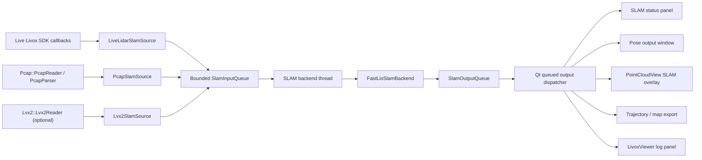
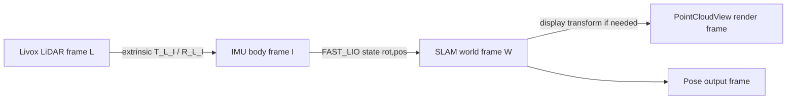

# LivoxViewerQT SLAM 集成开发计划

## 2026-06-29 Linux Eigen 安装指令修正

- 问题：Linux CMake 配置缺少 `third-party/eigen-3.4.0/Eigen/Core` 时，错误信息仍提示运行 Windows PowerShell 脚本 `scripts/setup_third_party.ps1`，在没有 `pwsh` 的 Linux 环境下无法执行。
- 修正：新增 `scripts/setup_third_party.sh`，Linux/macOS 使用 `bash scripts/setup_third_party.sh` 安装 Eigen 3.4.0 到仓库相对目录 `third-party/eigen-3.4.0`；Windows 继续使用 `pwsh -NoProfile -ExecutionPolicy Bypass -File scripts/setup_third_party.ps1`。
- 修正：`CMakeLists.txt` 根据 `WIN32` 选择缺失 Eigen 时的报错修复命令；Linux 下现在会提示 `bash "<repo>/scripts/setup_third_party.sh"`，不再提示 PowerShell 命令。
- 修正：`.gitignore` 放行 `scripts/setup_third_party.sh`，保持 `third-party/eigen-3.4.0/` 和 `third-party/.downloads/` 仍为本地下载产物，不进入 Git。
- 后续 Linux 编译规则：首次配置前先执行 `bash scripts/setup_third_party.sh`；若需要重装 Eigen，执行 `bash scripts/setup_third_party.sh --force`；随后再运行 `cmake -S . -B build/cmd-linux-Release -DCMAKE_BUILD_TYPE=Release` 和 `cmake --build build/cmd-linux-Release -j`。
- 验证：2026-06-29 当前 Windows 环境执行 `git diff --check` 通过，仅有既有 LF/CRLF 提示；显式执行 MSVC 环境下 CMake configure 通过；`cmake --build ... --target LivoxViewerQT SlamPhase4Replay --parallel 4` 通过。
- 验证缺口：当前 Windows 主机没有 `bash`/WSL/Docker，仍无法在本机实际执行 `scripts/setup_third_party.sh` 或 Linux configure/build；需要在 Linux 目标机按上述规则复验。

## 2026-06-29 Linux ikd-Tree shared_ptr 编译修正

- 问题：Linux GCC 9.4 编译 `libs/Slam/third_party/fast_lio/include/ikd-Tree/ikd_Tree.cpp` 时失败，首个错误为 `ikd_Tree.h:57:22: error: 'shared_ptr' in namespace 'std' does not name a template type`。
- 原因：`ikd_Tree.h` 使用 `std::shared_ptr`，但只包含了 C 头 `<memory.h>`，没有直接包含 C++ 头 `<memory>`；MSVC 当前构建通过是因为其他头间接带入，GCC 下不能依赖这种隐式 include。
- 修正：在 `libs/Slam/third_party/fast_lio/include/ikd-Tree/ikd_Tree.h` 增加 `#include <memory>`，不改动 ikd-Tree 算法逻辑。
- 验证：2026-06-29 已基于 `//192.168.2.50/Shared Folder/build.log` 定位首个 Linux 编译错误；当前 Windows 主机无法直接执行 Linux 构建，修复后需要在 Linux 目标机重新运行 `cmake --build build/cmd-linux-Release -j` 复验。

## 1. 目标与非目标

### 1.1 本阶段目标

本计划面向把 FAST_LIO 类 SLAM 后端工程化集成到 LivoxViewerQT，覆盖在线和离线两条链路：

| 能力 | 目标 |
|---|---|
| 在线 SLAM | 基于 Livox SDK 实时点云和 IMU 流建图、定位、输出位姿 |
| 离线 PCAP SLAM | 基于 PCAP 播放数据流复现建图、定位、轨迹和地图 |
| 建图 | 维护局部地图和可选全局稀疏地图，用于显示和导出 |
| 定位 | 输出 world/body/lidar 坐标系下的当前位姿 |
| 位姿输出 | 支持 UI 面板显示、日志记录、CSV/TUM 导出 |
| 轨迹显示 | 在点云视图中显示轨迹线和当前位姿坐标轴 |
| 地图显示 | 支持局部地图、全局稀疏地图、最大点数限制和降采样 |
| 双平台 | Windows 10/11 与 Ubuntu 20.04/22.04 都可编译、运行、打包 |

### 1.2 非目标

- 不把 ROS 运行时作为 LivoxViewerQT 的必需依赖。
- 不把 `E:\Livox_ws\FAST_LIO` 的 ROS 节点原样嵌入主程序。
- 第一版不一次性实现完整闭环优化。
- 第一版不一次性实现多雷达融合。
- 第一版不要求任意 seek 后增量恢复 SLAM 状态。
- 第一版不要求纯 LiDAR 模式；如后续确需支持，应作为独立后端或降级模式评估。

### 1.3 当前必须先解决的关键判断

| 判断项 | 结论 |
|---|---|
| 当前 `PointCloudFrame` 能否直接作为 FAST_LIO 输入 | 不能。缺少点内相对时间、IMU 连续样本队列、帧起止时间、坐标系/外参语义 |
| 当前 PCAP 是否能提供 IMU | 能解析 PCAP IMU payload，但时间戳来自 pcap 包时间；包内多个 IMU 样本共享同一时间戳 |
| 当前 LVX2 是否能提供 IMU | 待确认。现有 `Lvx2Reader` 未覆盖 `readImuSamples()` |
| 是否可直接引入 FAST_LIO 依赖 | 不建议。ROS、PCL、Python、tf、catkin 依赖对 Windows 和安装包不友好 |
| FAST_LIO 许可证是否清晰 | 待确认且风险高。`package.xml` 写 BSD，根目录 `LICENSE` 是 GPL-2.0 文本 |

## 2. 当前项目能力盘点

### 2.1 实时数据链路

已确认的实时链路：

```text
startLidarDiscovery()
  -> QUdpSocket 发送广播并解析 LidarDiscoveryService::DiscoveryResponse
  -> finalizeDiscoveredLidars()
  -> initializeLivoxSdk()
  -> LidarSdkService::initialize(configPath)
  -> LivoxLidarSdkInit(config.json)
  -> LidarSdkService::registerCallbacks()
       SetLivoxLidarInfoChangeCallback(onLidarDeviceInfoChange)
       SetLivoxLidarPointCloudCallBack(onPointCloudData)
       SetLivoxLidarImuDataCallback(onImuData)
       SetLivoxLidarInfoCallback(onStatusInfo)

SDK point cloud callback thread
  -> LivoxViewerWindow::onPointCloudData()
  -> deep copy LivoxLidarEthernetPacket
  -> QMetaObject::invokeMethod(..., Qt::QueuedConnection)
  -> registerPointCloudDeviceIfNeeded()
  -> decodePointCloudPacket()
  -> PointCloudDecoder::decodeLivoxPacket()
  -> pendingFrames[handle].enqueue(PointCloudFrame)

renderTimer, 33 ms
  -> onRenderTick()
  -> 从 pendingFrames 合并 frameIntervalMs 窗口，默认 100 ms
  -> applyPointCloudPipeline()
  -> handlePointCloudRecording()
  -> presentPointCloudFrame()
  -> PointCloudView::updatePointCloud()
  -> OpenGL buffer upload and paintGL()
```

关键文件和函数：

| 事项 | 文件 / 函数 |
|---|---|
| SDK 初始化 | `apps/LivoxViewer/actions/LidarSdkActions.cpp::initializeLivoxSdk()` |
| SDK 封装 | `libs/LivoxCore/src/LidarSdkService.cpp` |
| 设备发现 | `startLidarDiscovery()`、`sendLidarBroadcastDiscovery()`、`handleParsedDiscoveryResponse()` |
| 点云回调 | `apps/LivoxViewer/actions/LidarSdkCallbacks.cpp::onPointCloudData()` |
| IMU 回调 | `apps/LivoxViewer/actions/LidarSdkCallbacks.cpp::onImuData()` |
| 点云解码 | `libs/PointCloud/src/PointCloudDecoder.cpp::decodeLivoxPacket()` |
| 渲染合帧 | `apps/LivoxViewer/actions/PointCloudRuntimeActions.cpp::onRenderTick()` |
| 点云显示 | `libs/PointCloud/src/PointCloudView.cpp::updatePointCloud()`、`paintGL()` |

已确认的数据结构：

```cpp
struct PointCloudPoint {
    float x, y, z;
    float r, g, b;
    uint8_t reflectivity;
    uint8_t tag;
    uint8_t line;
    bool spherical;
    float theta;
    float phi;
    float depth;
};

struct PointCloudFrame {
    QVector<PointCloudPoint> points;
    QMap<uint32_t, QVector<PointCloudPoint>> pointsByLidar;
    uint64_t timestamp;
    uint32_t device_handle;
};
```

实时链路缺口：

| 缺口 | 当前代码情况 | 对 SLAM 的影响 |
|---|---|---|
| 点内相对时间 | `PointCloudPoint` 没有字段；解码忽略 `LivoxLidarEthernetPacket::time_interval` | FAST_LIO 去畸变依赖每点 offset time，必须补 |
| 帧起止时间 | `PointCloudFrame::timestamp` 只有单值 | 无法严格同步 IMU 覆盖到帧尾 |
| IMU 连续队列 | `ImuRuntimeState::latestSample` 只保留当前设备最新样本；可视化缓存保留 60 秒但不是 SLAM 队列 | 后端无法按帧取 IMU 区间 |
| IMU 点内时间 | 包内多个 IMU 样本都用同一个包时间戳 | 高频 IMU 积分精度不足，需确认 Livox SDK 时间语义 |
| 坐标系命名 | 点云显示直接用 xyz，未标注 lidar/body/world | 算法坐标和显示坐标容易混淆 |
| 外参来源 | 参数面板有设备安装姿态 `kKeyInstallAttitude`，但不是算法配置 | 需要独立 SLAM 外参配置 |
| 队列上限 | `pendingFrames` 按时间窗口淘汰，未看到显式最大队列长度 | SLAM 后端需自带 backpressure |

待确认项：

- `LivoxLidarEthernetPacket::time_interval` 是否可安全展开到每个点的相对时间。
- 不同 Livox 型号的点排列与 `lineForPointIndex(i, lineCount)` 推导是否满足 FAST_LIO。
- SDK `timestamp[8]` 的时钟源在 GPS/PTP/NTP/内部时钟下是否和 IMU 完全一致。
- `time_type` 是否必须进入 `SlamInputFrame`，用于时间可靠性提示。

### 2.2 离线 PCAP 链路

已确认的 PCAP 链路：

```text
FileActions / drag-drop
  -> loadPcapPlaybackFile(filePath)
  -> std::thread
  -> Pcap::PcapReader::load()
  -> PcapParser::parseFileToFrames()
       scanMetadata()
       parseDataFramesAndImuSamples()
  -> frames_ + imuSamples_ + devices_ + extrinsics_
  -> QMetaObject::invokeMethod(...)
  -> finishPlaybackSourceLoad()
  -> showLvx2PlaybackFrame(0)

Playback timer / seek / step
  -> showLvx2PlaybackFrame()
  -> Playback::Source::readFrame()
  -> applyPointCloudPipeline()
  -> PointCloudView::appendPointCloudSegment() or updatePointCloud()
  -> if SourceKind::Pcap:
       readImuSamples(startNs, endNs)
       appendPlaybackImuSamples()
```

关键文件：

| 事项 | 文件 / 函数 |
|---|---|
| PCAP 加载入口 | `apps/LivoxViewer/actions/PcapPlaybackActions.cpp::loadPcapPlaybackFile()` |
| 统一播放接口 | `libs/Playback/include/Playback/PlaybackSource.h` |
| PCAP reader | `libs/Pcap/src/PcapReader.cpp` |
| PCAP 解析 | `libs/Pcap/src/PcapParser.cpp` |
| 点云 payload | `libs/Pcap/src/PointParser.cpp` |
| IMU payload | `libs/Pcap/src/ImuParser.cpp` |
| 播放控制 | `apps/LivoxViewer/actions/PlaybackControllerActions.cpp` |

PCAP 已有能力：

- 支持 `.pcap` / `.pcapng`。
- 使用 Npcap SDK / libpcap。
- `PcapParser::parseFileToFrames()` 扫描 metadata，再解析数据。
- `PointParser::FrameBuilder::kFrameDurationNs = 50 ms`。
- `PcapReader::readImuSamples(startTimestampNs, endTimestampNs)` 可按区间返回 IMU。
- PCAP 和 LVX2 复用 `Playback::Source`、播放条、滑动窗口、逐帧模式、速度、暂停、前后帧和 seek。

PCAP 当前问题：

| 问题 | 当前代码 | SLAM 影响 |
|---|---|---|
| 点云时间戳 | `PointParser::pcapTimestampNs(header)` 使用 pcap 包头时间 | 不一定等于 Livox 硬件时间 |
| 点内时间 | PCAP 解析忽略 Livox payload header 中的 `time_interval` | FAST_LIO 去畸变缺少关键输入 |
| IMU 时间戳 | `ImuParser::appendImuPayload()` 对包内所有样本使用同一 `timestampNs` | IMU 积分精度不足 |
| 离线帧结构 | `PointCloudFrame` 仍是显示帧，不是 SLAM 输入帧 | 需要新增转换层 |
| seek | 现有 seek 只更新显示窗口和 IMU 可视化 | SLAM 状态不能简单跳转，必须重跑或 checkpoint |

离线 SLAM 接入建议：

- 不直接在 `showLvx2PlaybackFrame()` 中运行 SLAM。
- 新增 `PcapSlamSource`，从 `PcapReader` 或更底层 `PcapParser` 产出 `SlamInputFrame`。
- 离线 SLAM 支持两种运行模式：
  - 原始时间回放：按包/帧时间驱动，便于和 UI 同步。
  - 最快速度建图：不等待 UI timer，只受后端处理速度和队列 backpressure 限制。
- MVP 对 seek 的策略：seek 后清空 SLAM 状态，从文件开头重跑到目标帧；不承诺增量恢复。

### 2.3 OpenGL / UI 可视化链路

已确认能力：

| 能力 | 当前实现 |
|---|---|
| 点云显示 | `PointCloudView` 继承 `QOpenGLWidget`，使用 VBO/VAO 绘制 GL_POINTS |
| 多段点云 | `appendPointCloudSegment()` / `removeFirstPointCloudSegment()` 支持滑动窗口分段 |
| 网格 | `PointCloudView::GridConfig` 支持方格、同心圆、组合 |
| 坐标轴 | `setupAxesBuffers()` 和 `paintGL()` 中左下角 overlay 坐标轴 |
| 图例 | `setLegend()`，支持反射率、距离、高程、线号、纯色 |
| 相机操作 | arcball 旋转、缩放、双击设中心、预设视角、正交/透视 |
| 选择/截面 | selection、AABB、cross-section，部分计算走 `QtConcurrent::run` |
| STL 模型 | `setStlModelMesh()`、`setStlModelVisible()` |

未发现的 SLAM 专用能力：

- 轨迹线绘制 API。
- 当前位姿坐标轴绘制 API。
- 局部地图和全局地图双层数据模型。
- 地图点数上限/分块/LOD 策略。
- 相机跟随当前位姿。
- SLAM 状态面板、位姿输出窗口、轨迹导出入口。

SLAM 可视化接入方案：

1. 在 `slam/visualization/` 设计纯数据模型：`SlamTrajectoryPoint`、`SlamMapChunk`、`SlamPoseRenderState`。
2. `PointCloudView` 增加最小渲染扩展：
   - `setSlamTrajectory(QVector<SlamTrajectoryPoint>)`
   - `appendSlamMapChunk(SlamMapChunk)`
   - `setCurrentSlamPose(SlamPose)`
   - `clearSlamOverlay()`
3. OpenGL 侧新增独立 VBO/VAO：
   - 轨迹用 `GL_LINE_STRIP`。
   - 当前位姿坐标轴用 `GL_LINES`。
   - 地图用低优先级点云 VBO，和实时原始点云分离。
4. UI 侧新增 SLAM 状态 dock/panel，不把状态文本塞进 `PointCloudView`。

渲染线程隔离建议：

- SLAM 线程只产出不可变快照，不直接调用 `PointCloudView`。
- UI 主线程通过 queued signal 接收 `SlamOutput`，再更新 OpenGL 数据。
- 大地图采用 chunk 增量上传，不在 UI tick 里复制完整地图。
- 所有地图点上屏前先降采样并限制最大点数。

### 2.4 线程模型

当前线程/定时器：

| 线程/触发源 | 当前职责 |
|---|---|
| Qt 主线程 | UI、`renderTimer`、播放 timer、OpenGL widget 更新、SDK 回调后的实际解析 |
| SDK 回调线程 | 收到 SDK 点云/IMU，深拷贝后 `QueuedConnection` 投递到主线程 |
| PCAP/LVX2 加载线程 | `std::thread(...).detach()` 加载文件，再投递结果 |
| 播放 timer | `PlaybackControllerState::timer`，驱动 `onLvx2PlaybackTick()` |
| IMU display thread | `ImuActions.cpp` 中 `std::thread` 轮询最新 IMU 并更新 UI |
| Serial thread | GPS/串口相关 |
| QtConcurrent | 点云选择、截面裁剪、选择发布等后台计算 |

集成 SLAM 后推荐线程模型：

```text
Live SDK callback / Pcap reader / Lvx2 reader
  -> SlamSource adapter
  -> bounded SlamInputQueue
  -> SlamBackend worker thread
       FastLioSlamBackend
       map / state / trajectory
  -> bounded SlamOutputQueue
  -> Qt queued signal
  -> UI state panel + PointCloudView overlay
```

规则：

- 不能在 UI 线程执行 FAST_LIO 后端、地图增量更新、KD-tree 查询、全局地图导出。
- 不能在 SDK 回调线程做重计算；回调只做最小复制和投递。
- 不能让 OpenGL 线程读取 SLAM 内部可变容器；必须复制或交换快照。
- 在线队列必须有 backpressure：按策略丢旧帧、暂停建图或仅保留最新局部地图输出。
- 离线最快模式必须与 UI 播放 timer 解耦。

## 3. FAST_LIO 可集成性评估

### 3.1 当前 FAST_LIO 代码结构

`E:\Livox_ws\FAST_LIO` 的主要代码：

| 文件 | 职责 |
|---|---|
| `src/laserMapping.cpp` | ROS 节点主循环、订阅、同步、建图、发布 |
| `src/preprocess.h/cpp` | Livox/Velodyne/Ouster 点云预处理，点内时间写入 `PointType::curvature` |
| `src/IMU_Processing.hpp` | IMU 初始化、积分、点云去畸变 |
| `include/use-ikfom.hpp` | IKFoM 状态、输入和过程模型 |
| `include/common_lib.h` | `MeasureGroup`、点类型、工具函数 |
| `include/ikd-Tree/` | 增量 KD-tree |
| `config/mid360.yaml` | Mid360 典型参数 |

### 3.2 直接接入难点

| 难点 | 说明 |
|---|---|
| ROS 强耦合 | `ros::init`、`NodeHandle::param`、subscriber、publisher、`sensor_msgs`、`nav_msgs`、`tf` |
| PCL 强耦合 | 点类型、`pcl::VoxelGrid`、`pcl::PointCloud`、PCD writer、ROS/PCL conversion |
| 点内时间要求 | Livox CustomMsg 中 `offset_time` 被写入 `curvature`；当前 LivoxViewerQT 没有该字段 |
| IMU 同步要求 | `sync_packages()` 要求 IMU 覆盖到 `lidar_end_time` |
| 全局变量多 | `laserMapping.cpp` 大量全局状态，不适合作为库直接调用 |
| Linux 假设 | `unistd.h`、catkin、ROS、PCL 组合对 Windows/MSVC 不友好 |
| Python 依赖 | CMake 强制 `find_package(PythonLibs REQUIRED)`，主程序不需要 |
| 许可证冲突 | `package.xml` BSD vs 根 `LICENSE` GPL-2.0，商业交付需先确认 |

### 3.3 推荐接入方式

推荐方式：提取算法核心并封装为无 ROS 运行时的 C++ 后端库。

- 保留：
  - Eigen。
  - IKFoM / MTK ESKF 核心。
  - 点云去畸变逻辑。
  - 平面残差构建和迭代 EKF 更新逻辑。
  - ikd-Tree 或可替代增量地图结构。
  - OpenMP，可作为可选编译项。
- 剥离：
  - `ros::init`、topic、publisher/subscriber。
  - `sensor_msgs`、`nav_msgs`、`geometry_msgs`、`tf`。
  - `livox_ros_driver::CustomMsg`。
  - `rosbag`。
  - Python / matplotlib。
  - ROS parameter server。
- 替换：
  - ROS 参数 -> `SlamRuntimeConfig`。
  - ROS msg -> `SlamInputFrame`、`SlamImuSample`、`SlamOutput`。
  - ROS publish -> Qt signal / output queue。
  - PCL VoxelGrid -> 自研 voxel hash 降采样或轻量第三方库。
  - PCD writer -> 复用 `PointCloudExport` 或新增 `SlamExport`。

不推荐方式：

- 在 LivoxViewerQT 内启动 ROS master/node。
- 用 rosbag 作为离线 PCAP 的中间格式。
- 把 `laserMapping.cpp` 作为黑盒子编译进主程序。
- 为了省移植成本把 PCL、catkin、tf 全量引进 Windows 安装包。

### 3.4 依赖评估

| 依赖 | FAST_LIO 用途 | 建议 | Windows 风险 | 包体积 / 交付风险 |
|---|---|---|---|---|
| Eigen | 矩阵、四元数、状态估计 | 必须保留 | 低，注意对齐 | 低 |
| IKFoM / MTK | ESKF 流形状态 | 保留或内置为后端子模块 | 中，模板兼容需测 MSVC | 许可证待确认 |
| ikd-Tree | 增量地图 | 保留或替换 | 中，pthread/OpenMP 相关需测 | 许可证待确认 |
| PCL | 点云容器、VoxelGrid、PCD | 当前不安装完整 PCL；由项目内 `fast_lio_compat` 提供 FAST_LIO 当前所需最小头层 | 中，继续防止引入真实 PCL runtime | 低 |
| Boost | 原版 IKFoM/MTK 宏和少量工具头 | 当前已剥离，不安装完整 Boost，不新增 Boost 兼容层 | 低，需防止重新包含 `boost/*` | 低 |
| OpenMP | 并行搜索/处理 | 可选 | 中，MSVC/GCC flag 差异 | 低 |
| ROS/catkin | 节点、topic、参数 | 必须剥离 | 极高 | 高 |
| livox_ros_driver | CustomMsg | 必须剥离 | 高 | 中 |
| yaml | 参数配置 | 可用 Qt JSON/QSettings 替代；如需 yaml，选轻量库 | 中 | 低 |
| glog/fmt/spdlog | 当前 FAST_LIO 未强依赖 | 不主动引入 | 低 | 低 |
| Python/matplotlib | debug plotting | 剥离 | 中 | 中 |
| nav_msgs/sensor_msgs/tf | 发布消息和坐标广播 | 剥离 | 高 | 高 |

## 4. 总体架构设计

### 4.1 架构图



### 4.2 架构原则

- `slam/core` 不依赖 Qt Widgets、OpenGL、Livox SDK、Pcap、Lvx2。
- `slam/io` 负责从现有数据源适配到 `SlamInputFrame`。
- `slam/backends/fastlio` 不依赖 ROS。
- `slam/visualization` 只做数据转换，不持有算法状态。
- UI 只消费 `SlamOutput`，不直接访问后端内部地图。

### 4.3 需先做代码调研确认

| 项 | 是否阻塞设计 | 说明 |
|---|---|---|
| 点内时间展开方式 | 阻塞 Phase 1 | 需要确认 `time_interval` 与 dot 顺序 |
| PCAP payload timestamp | 阻塞 Phase 2 | 需要确认是否可解析 payload 内 `timestamp[8]` 替代 pcap header |
| IMU 包内样本时间 | 阻塞 Phase 1/2 | 需要确认 IMU `dot_num > 1` 时样本间隔 |
| FAST_LIO 许可证 | 阻塞 Phase 4 | 不能等到实现后再处理 |
| Mid-360S 外参默认值 | 不阻塞接口 | 可先配置化，后续标定 |

## 5. 数据结构设计

### 5.1 统一时间语义

- 内部统一使用 `int64_t timestamp_ns`。
- `frame_start_ns` 和 `frame_end_ns` 表示 LiDAR 帧覆盖时间。
- `point_time_offset_ns` 表示点相对 `frame_start_ns` 的时间。
- 所有来源必须标记 `time_source`：
  - `LivoxPacketTimestamp`
  - `PcapCaptureTimestamp`
  - `SynthesizedFromPacketInterval`
  - `Unknown`

### 5.2 建议结构

```cpp
struct SlamPoint {
    float x = 0.0f;
    float y = 0.0f;
    float z = 0.0f;
    uint8_t reflectivity = 0;
    uint8_t tag = 0;
    uint8_t line = 0;
    bool hasLine = false;
    int64_t offsetNs = 0;
    bool hasOffsetTime = false;
};

struct SlamImuSample {
    uint32_t lidarId = 0;
    int64_t timestampNs = 0;
    double gyroRadPerSec[3] = {};
    double accelMps2[3] = {};
};

struct SlamInputFrame {
    uint64_t sequence = 0;
    uint32_t sourceId = 0;
    uint8_t deviceType = 0;
    int64_t frameStartNs = 0;
    int64_t frameEndNs = 0;
    QVector<SlamPoint> points;
    QVector<SlamImuSample> imuSamples;
    bool hasPointOffsetTime = false;
    bool hasCompleteImuCoverage = false;
    QString sourceName;
};

struct SlamPose {
    int64_t timestampNs = 0;
    double tx = 0.0;
    double ty = 0.0;
    double tz = 0.0;
    double qx = 0.0;
    double qy = 0.0;
    double qz = 0.0;
    double qw = 1.0;
    double covariance[36] = {};
    bool hasCovariance = false;
};

struct SlamTrajectoryPoint {
    SlamPose pose;
    double quality = 1.0;
};

struct SlamMapChunk {
    uint64_t chunkId = 0;
    int64_t timestampNs = 0;
    QVector<SlamPoint> pointsWorld;
    double voxelSizeM = 0.1;
    bool isLocal = false;
};

enum class SlamStatusCode {
    Idle,
    Starting,
    InitializingImu,
    Running,
    Paused,
    Backpressure,
    MissingImu,
    TimeSyncError,
    Degraded,
    Failed,
    Stopped
};

struct SlamRuntimeConfig {
    QString backendType = "FAST_LIO";
    QString lidarModel;
    SlamLidarTemplate lidarTemplate = SlamLidarTemplate::Mid360Mid360S;
    bool imuEnabled = true;
    bool allowPureLidar = false;
    int64_t lidarToImuTimeOffsetNs = 0;
    double gravityNorm = 9.81;
    double extrinsicT_L_I[3] = {-0.011, -0.02329, 0.04412};
    double extrinsicR_L_I[9] = {1,0,0, 0,1,0, 0,0,1};
    bool extrinsicEstimationEnabled = false;
    double cubeSideLengthM = 200.0;
    double detRangeM = 100.0;
    double fovDegree = 360.0;
    double blindMinRangeM = 0.5;
    double gyrCov = 0.1;
    double accCov = 0.1;
    double bGyrCov = 0.0001;
    double bAccCov = 0.0001;
    int maxIterations = 4;
    double filterSizeSurfM = 0.5;
    double filterSizeMapM = 0.5;
    double mapVoxelSizeM = 0.1;
    int maxMapPoints = 2000000;
    int maxTrajectoryPoints = 200000;
    int maxInputQueueFrames = 8;
    bool saveTrajectory = false;
    bool saveMap = false;
    QString logLevel = "info";
};

struct SlamOutput {
    SlamStatusCode status = SlamStatusCode::Idle;
    SlamPose currentPose;
    QVector<SlamTrajectoryPoint> newTrajectoryPoints;
    QVector<SlamMapChunk> newMapChunks;
    QString message;
    double inputFps = 0.0;
    double backendMs = 0.0;
    int droppedFrameCount = 0;
    int mapPointCount = 0;
    int trajectoryPointCount = 0;
    bool imuHealthy = false;
};
```

### 5.3 当前结构到 SLAM 结构的差距

| 当前结构 | 可复用字段 | 必须新增 |
|---|---|---|
| `PointCloudPoint` | xyz、reflectivity、tag、line | point offset time、time validity、source lidar id |
| `PointCloudFrame` | `timestamp`、`device_handle`、points | frame start/end、IMU samples、time source、device type |
| `Playback::ImuSample` | lidarId、timestamp、gyro、acc | 单位约定、时间可靠性、包内样本间隔 |
| `Playback::Source` | `readFrame()`、`readImuSamples()` | SLAM 专用顺序读接口、reset/seek 语义 |

## 6. 模块划分建议

建议新增目录：

```text
libs/Slam/
  include/Slam/Core/
    SlamTypes.h
    ISlamBackend.h
    SlamInputQueue.h
    SlamRuntimeConfig.h
  include/Slam/Backends/FastLio/
    FastLioSlamBackend.h
  include/Slam/Io/
    LiveLidarSlamSource.h
    PcapSlamSource.h
    Lvx2SlamSource.h
  include/Slam/Visualization/
    SlamRenderTypes.h
  include/Slam/Export/
    SlamTrajectoryExport.h
  src/...
```

依赖方向：

| 模块 | 允许依赖 | 禁止依赖 |
|---|---|---|
| `Slam/Core` | STL、Eigen 可选、Qt Core 容器可选 | Qt Widgets、OpenGL、Livox SDK、Pcap、Lvx2 |
| `Slam/Io` | `Slam/Core`、LivoxCore、Pcap、Lvx2、Playback | Qt Widgets、OpenGL、后端内部状态 |
| `Slam/Backends/FastLio` | `Slam/Core`、Eigen、IKFoM、ikd-Tree | ROS、catkin、sensor_msgs、tf、QWidget |
| `Slam/Visualization` | `Slam/Core`、PointCloud 类型转换 | 后端算法细节、SDK 回调 |
| `Slam/Export` | `Slam/Core`、QFile/QTextStream | UI、OpenGL |
| `apps/LivoxViewer` | 所有上层模块 | 直接访问 FAST_LIO 全局变量 |

## 7. 在线 SLAM 设计

### 7.1 数据进入 SLAM 的位置

建议新增独立实时输入链路，不复用 `onRenderTick()` 的显示合帧：

```text
onPointCloudData()
  -> decode packet for display (existing)
  -> LiveLidarSlamSource::appendPointPacket(packet metadata + decoded points)

onImuData()
  -> existing IMU UI cache
  -> LiveLidarSlamSource::appendImuPacket(samples)

LiveLidarSlamSource
  -> assemble SlamInputFrame by frame duration or frame_cnt/timestamp
  -> attach IMU samples covering [frameStartNs, frameEndNs]
  -> push to SlamInputQueue
```

不建议从 `pendingFrames` 取 SLAM 输入，因为它是显示滑动窗口队列，会丢弃旧帧并合并多包，缺少精确帧边界。

### 7.2 帧组装策略

- 优先按 Livox packet `timestamp` 和 `time_interval` 计算点时间。
- 初始按 50 ms 作为 Mid-360/Mid-360S SLAM 帧窗口，后续从设备参数确认实际帧率。
- `SlamInputFrame::frameStartNs` 使用首包 timestamp。
- `frameEndNs` 使用最大点 timestamp 或最后包 timestamp + packet duration。
- 对包内点：
  - `offsetNs = point_abs_ns - frameStartNs`
  - 如果只能推断，设置 `hasOffsetTime = true` 且 `timeSource = SynthesizedFromPacketInterval`。
  - 如果无法推断，标记 `hasPointOffsetTime = false`，FAST_LIO 后端应拒绝运行或进入降级状态。

### 7.3 时间同步策略

- 在线模式必须要求 LiDAR 和 IMU 同一硬件/同步时钟。
- 提供 `lidarToImuTimeOffsetNs` 配置项，默认 0。
- 若 IMU 最后时间小于 `frameEndNs`，后端不处理该帧，等待或丢帧。
- 若 IMU 与 LiDAR 时间差超过阈值，状态进入 `TimeSyncError`。

### 7.4 丢帧和 backpressure

在线推荐策略：

| 情况 | 策略 |
|---|---|
| 输入队列满 | 丢弃最旧未处理 LiDAR 帧，累计 droppedFrameCount |
| IMU 不足 | 短时间等待；超过阈值后丢该帧 |
| 后端长时间慢于输入 | 状态 `Backpressure`，UI 显示降级；可降低地图输出频率 |
| UI 消费慢 | 输出队列只保留最新状态、轨迹增量和有限地图 chunk |

### 7.5 生命周期

启动：

```text
用户启用 SLAM
  -> 校验设备、IMU、时间戳、外参配置
  -> 创建 LiveLidarSlamSource
  -> 创建 FastLioSlamBackend
  -> 启动后端线程
  -> 状态 Starting / InitializingImu / Running
```

停止：

```text
用户停止 SLAM 或 SDK shutdown
  -> 停止输入源
  -> 输入队列 close
  -> 后端 drain 或立即 stop
  -> 输出最终轨迹/地图快照
  -> 清理 UI overlay 可选
```

重置：

```text
reset
  -> pause input
  -> clear queue
  -> backend.reset()
  -> clear trajectory/map overlay
  -> resume input from next complete frame
```

### 7.6 UI 控制项

- 启用/停止 SLAM。
- 模式：在线 / 离线。
- 后端：FAST_LIO。
- 状态：Idle、InitializingImu、Running、Paused、Failed。
- 当前位姿：x/y/z、roll/pitch/yaw、四元数。
- 输入帧率、SLAM 耗时、丢帧数。
- IMU 状态、时间同步状态。
- 地图点数、轨迹点数。
- 清空地图/轨迹。
- 导出轨迹。

## 8. 离线 PCAP SLAM 设计

### 8.1 PCAP 接入方式

建议新增 `PcapSlamSource`：

- 使用 `PcapParser` 或扩展 `PcapReader` 顺序读取原始包。
- 生成与在线相同的 `SlamInputFrame`。
- 读取 PCAP IMU，按 `[frameStartNs, frameEndNs]` 附加到帧。
- 保留 `lidarId`，但 MVP 只允许单雷达。

### 8.2 原始时间 vs 最快速度

| 模式 | 行为 | 适用场景 |
|---|---|---|
| 原始时间回放 | 按 PCAP/Livox 时间推进，SLAM 输出和 UI 播放节奏接近 | 调试、演示 |
| 最快速度建图 | 后端尽快消费所有帧，不等待播放 timer | 离线建图、批处理 |

MVP 建议先做最快速度建图，因为结果更容易复现，不依赖 UI timer。

### 8.3 暂停 / 继续 / seek / reset

| 操作 | 策略 |
|---|---|
| pause | 输入源停止推帧，后端处理完当前帧后进入 Paused |
| resume | 从当前 frame index 继续 |
| stop | 关闭输入队列，保留或清空结果由 UI 决定 |
| reset | 后端 reset，清空地图/轨迹，从第 0 帧重新开始 |
| seek forward | MVP：停止并从第 0 帧重跑到目标帧 |
| seek backward | 同 seek forward |
| 快放 | 最快模式忽略 UI 快放倍速；原始时间模式按倍速调度 |

### 8.4 PCAP 缺少 IMU 的影响

FAST_LIO 当前设计依赖 IMU：

- IMU 初始化重力和 bias。
- IMU 前向传播。
- 点云去畸变。
- LiDAR 帧尾状态预测。

因此：

- MVP 不允许缺 IMU 的 FAST_LIO 模式。
- 若 PCAP 无 IMU，UI 显示 `MissingImu`，不启动 FAST_LIO。
- 后续可评估纯 LiDAR ICP/NDT 后端，但不应混称 FAST_LIO。

### 8.5 离线结果缓存和导出

- `SlamTrajectory` 保存在内存，支持 TUM 和 CSV 导出。
- 地图输出采用 chunk，支持保存稀疏地图 PCD/LAS。
- 同一 PCAP 多次运行应得到一致轨迹；测试计划中单独验证。

## 9. 可视化设计

### 9.1 需要新增的显示层

| 显示项 | 设计 |
|---|---|
| 当前位姿 | world 坐标系下的 body/lidar 坐标轴，独立颜色 |
| 轨迹 | `GL_LINE_STRIP`，按 `SlamTrajectoryPoint` 增量追加 |
| 局部地图 | 最近 N 个 map chunk，点数较密 |
| 全局地图 | 体素降采样后的稀疏点 |
| 状态面板 | dock 或右侧 panel，不覆盖点云视图 |

### 9.2 地图显示性能策略

- 默认只显示局部地图 + 稀疏轨迹。
- 全局地图默认最大 2,000,000 点，可配置。
- map chunk 每块记录 point count、voxel size、bounds。
- UI 每次最多上传固定数量 chunk，避免单帧卡顿。
- 输出频率限制：
  - pose/trajectory：10-30 Hz。
  - local map：1-5 Hz。
  - global map：按关键帧或用户请求。

### 9.3 UI 面板字段

| 字段 | 说明 |
|---|---|
| SLAM 状态 | Idle / InitializingImu / Running / Paused / Failed |
| 当前位姿 | x y z / roll pitch yaw / quaternion |
| 当前速度 | 可选，从后端状态输出 |
| 地图点数 | 当前后端地图点数和上屏点数 |
| 轨迹点数 | 轨迹长度 |
| 输入帧率 | SlamSource 推帧频率 |
| SLAM 耗时 | 每帧平均/最大耗时 |
| 丢帧计数 | backpressure 或时间同步失败导致 |
| IMU 状态 | 有无、覆盖率、时间差 |
| 错误信息 | 许可证/配置/时间戳/外参错误 |

## 10. 配置项设计

建议配置键：

| 配置项 | 类型 | 默认 |
|---|---|---|
| `slam/enabled` | bool | false |
| `slam/mode` | enum | online |
| `slam/backend` | enum | FAST_LIO |
| `slam/lidar_model` | string | 自动识别，待确认 |
| `slam/source_name` | string | live/current 或 file path |
| `slam/imu_enabled` | bool | true |
| `slam/allow_pure_lidar` | bool | false |
| `slam/time_offset_lidar_to_imu_ns` | int64 | 0 |
| `slam/gravity_norm` | double | 9.81 |
| `slam/extrinsic_T_L_I` | double[3] | 0,0,0 |
| `slam/extrinsic_R_L_I` | double[9] | identity |
| `slam/filter_size_surf_m` | double | 0.5 |
| `slam/filter_size_map_m` | double | 0.5 |
| `slam/map_voxel_size_m` | double | 0.1 |
| `slam/max_map_points` | int | 2000000 |
| `slam/max_trajectory_points` | int | 200000 |
| `slam/save_trajectory` | bool | false |
| `slam/save_map` | bool | false |
| `slam/log_level` | enum | info |

配置保存建议：

- UI 偏好用 `QSettings("Livox", "LivoxViewerQT")`，沿用现有习惯。
- 后端参数可导入/导出 JSON，放入 `libs/AppConfig` 后续实现。
- 不复用 SDK `config.json` 作为 SLAM 主配置，避免网络配置和算法配置混杂。

## 11. 构建系统和依赖管理

当前项目构建特点：

- 根 `CMakeLists.txt` 是单目标 `LivoxViewerQT`。
- 源文件和头文件手动列入 `SOURCES` / `HEADERS`。
- C++17。
- Qt6 优先，Qt5 fallback。
- Windows 链接 `livox_lidar_sdk_static.lib`、Npcap SDK、`ws2_32`、`winmm`。
- Linux 链接 `liblivox_lidar_sdk_static.a`、`pthread`、`dl`、`m`、`libpcap`。
- MSVC 使用 `/utf-8 /W4`。
- Linux 使用 `-Wall -Wextra -Wpedantic`。

SLAM 构建建议：

| 项 | 建议 |
|---|---|
| CMake 组织 | 新增 `libs/Slam` 文件并显式加入根 `SOURCES/HEADERS`；后续可拆静态库 |
| Eigen | 先 vendor 或 `find_package(Eigen3)`；注意 MSVC 对齐 |
| OpenMP | 作为 `option(SLAM_USE_OPENMP OFF)`，Windows/Linux 分别测试 |
| PCL | 当前不安装完整 PCL；仅允许继续使用项目内 `libs/Slam/third_party/fast_lio_compat/include/pcl` 最小兼容头层 |
| Boost | 当前不安装完整 Boost；不得新增 Boost 兼容层，若后续 FAST_LIO 代码再次依赖 `boost/*`，优先移除该依赖或固定展开原宏生成代码 |
| FAST_LIO core | 先在 `slam/backends/fastlio` 做最小可编译子集 |
| 静态/动态 | MVP 可编进主 exe；后续考虑插件化 |
| 安装包 | 避免 ROS/PCL，减少 Windows 安装复杂度 |
| AppImage/DEB | 只增加轻量依赖更可控 |

MSVC/GCC 风险：

- Eigen aligned allocator 和 Qt 容器混用需小心。
- `std::deque`、Eigen fixed-size types、aligned structs 需要统一策略。
- FAST_LIO 代码中的 `unistd.h`、`pthread`、宏和全局数组要替换。
- OpenMP flag 和运行时库需要分别验证。

## 12. 分阶段开发计划

### Phase 0：代码调研和最小接口设计

目标：

- 明确当前数据链路、时间戳、IMU、PCAP、渲染和线程模型。
- 固化 `SlamTypes` 和 `ISlamBackend` 最小接口。

任务：

- 调研 `time_interval`、`timestamp`、IMU packet 时间语义。
- 调研 Mid-360/Mid-360S 点序、line/tag、IMU 数据频率。
- 确认 FAST_LIO 许可证。
- 设计接口头文件，不接入 UI。

产出：

- `slam_dev_plan.md`。
- `SlamTypes.h` 草案。
- FAST_LIO 许可证确认记录。

验收标准：

- 能用实际文件/函数说明在线和离线数据链路。
- 能列出所有阻塞 Phase 1 的待确认项。
- 不修改现有业务行为。

### Phase 1：统一 SLAM 输入数据结构

目标：

- 新增 `SlamPoint`、`SlamInputFrame`、`SlamImuSample` 等核心结构。

任务：

- 新增 `libs/Slam/Core`。
- 编写从 `LivoxLidarEthernetPacket` 到 `SlamPoint` 的独立解析函数。
- 展开或标记点内相对时间。
- 新增 IMU sample collector。
- 单元测试点云/IMU packet 转换。

产出：

- 可编译的 `Slam/Core`。
- 时间戳和点字段单元测试。

验收标准：

- 同一包输入能生成包含 frame start/end、points、point offset 的 `SlamInputFrame`。
- 无点内时间时能明确返回错误状态，不静默降级。

### Phase 2：离线 PCAP 数据接入 SLAM 输入层

目标：

- PCAP 可顺序输出 `SlamInputFrame`，不运行后端。

任务：

- 新增 `PcapSlamSource`。
- 扩展 PCAP 解析读取 payload timestamp/time_interval。
- 按帧附加 IMU 区间样本。
- 对缺 IMU、时间乱序、点内时间缺失给出状态。

产出：

- PCAP -> `SlamInputFrame` 管线。
- 离线数据摘要日志。

验收标准：

- 给定 PCAP 可统计帧数、点数、IMU 样本数、时间范围。
- 能识别并报告无 IMU 的 PCAP。
- 不影响现有 PCAP 播放显示。

### Phase 3：实时数据接入 SLAM 输入层

目标：

- 实时 SDK 点云和 IMU 可进入统一输入队列。

任务：

- 新增 `LiveLidarSlamSource`。
- 在 SDK 回调中并行投递给 SLAM source。
- 实现 bounded input queue。
- 增加状态统计：输入 FPS、队列长度、丢帧数。

产出：

- 在线输入队列和统计。

验收标准：

- 开启/关闭 SLAM 输入不影响点云显示。
- 后端不启动时也能稳定统计输入帧。
- 队列满时策略可观测。

### Phase 4：FAST_LIO 后端工程化封装

目标：

- 完成无 ROS 的 `FastLioSlamBackend` 最小版本。

任务：

- 提取 IMU 初始化、去畸变、ESKF、地图增量更新。
- 替换 ROS msg 和参数。
- 替换或隔离 PCL VoxelGrid。
- 封装 `start()`、`stop()`、`reset()`、`processFrame()`。
- 输出 pose、trajectory、局部地图 chunk、状态。

产出：

- `FastLioSlamBackend`。
- 后端单元/离线回放测试。

验收标准：

- 不链接 ROS/catkin。
- Windows 和 Linux 都能编译。
- 对同一离线输入，多次运行轨迹一致。

### Phase 5：轨迹 / 位姿 / 地图可视化

目标：

- UI 可显示当前位姿、轨迹、局部地图和状态。

任务：

- 扩展 `PointCloudView` SLAM overlay。
- 新增 SLAM 状态 panel。
- 实现最大点数、降采样、chunk 上传。
- 增加清空轨迹/地图操作。

产出：

- 可视化 UI 和 OpenGL overlay。

验收标准：

- SLAM 运行时 UI 不卡顿。
- 地图点数达到配置上限时不会持续增长。
- 关闭 SLAM overlay 不影响原点云显示。

### Phase 6：配置、导出、日志、异常处理

目标：

- 配置持久化、轨迹导出、地图导出和错误提示完整。

任务：

- 实现 `SlamRuntimeConfig` 保存/加载。
- TUM/CSV 轨迹导出。
- 稀疏地图 PCD/LAS 导出。
- 错误状态和日志统一。

产出：

- SLAM 设置页。
- `SlamTrajectoryExport`。

验收标准：

- 重启应用后 SLAM 配置保留。
- 轨迹文件可被常用工具读取。
- 缺 IMU/时间戳异常/外参缺失都有明确 UI 提示。

### Phase 7：跨平台编译、性能优化、测试

目标：

- 达到 Windows/Linux 可交付状态。

任务：

- 使用 `C:\Users\FelixCooper\Desktop\compile.bat` 验证 Windows 编译。
- Linux CMake 编译验证。
- 长时间运行内存测试。
- 大地图渲染性能测试。
- 在线实测 Mid-360/Mid-360S。

产出：

- 编译记录、性能记录、测试报告。

验收标准：

- Windows Release 编译通过。
- Linux Release 编译通过。
- 在线运行 30 分钟无明显内存失控。
- UI 操作响应不被 SLAM 后端阻塞。

## 13. 测试计划

| 测试类型 | 内容 | 验收 |
|---|---|---|
| 单元测试 | packet -> `SlamInputFrame`、IMU 区间选择、外参变换 | 字段和时间戳符合预期 |
| 离线 PCAP 回放 | PCAP 最快模式跑完整轨迹 | 无崩溃，输出轨迹 |
| 在线雷达实测 | Mid-360/Mid-360S 实时 SLAM | 状态正常，轨迹连续 |
| IMU 缺失 | 关闭 IMU 或使用无 IMU PCAP | 后端拒绝并提示 `MissingImu` |
| 时间戳异常 | 构造乱序、跳变、重复时间 | 能丢帧或报错，不崩溃 |
| 点云丢包 | 输入缺帧/点数突降 | 状态可观测，后端不阻塞 |
| 长时间运行 | 在线 30-60 分钟 | 内存受控，无 UI 卡死 |
| 大地图性能 | 地图超过 200 万点 | 上屏点数受限，帧率可接受 |
| Windows 编译 | `C:\Users\FelixCooper\Desktop\compile.bat` | 编译通过 |
| Linux 编译 | Ubuntu 20.04/22.04 CMake | 编译通过 |
| UI 响应性 | 拖动视角、切 tab、暂停/继续 | 无明显阻塞 |
| 一致性 | 同一 PCAP 多次运行 | 轨迹数值一致或差异在阈值内 |

## 14. 风险清单

| 风险项 | 等级 | 影响 | 触发条件 | 规避方案 | 是否阻塞第一阶段 |
|---|---|---|---|---|---|
| FAST_LIO 许可证冲突 | 高 | 商业交付和代码分发受限 | package.xml 与 LICENSE 不一致 | 先做法务/上游确认；必要时改用许可证清晰实现 | 是 |
| ROS 依赖剥离成本 | 高 | Phase 4 工期增加 | 直接移植 `laserMapping.cpp` | 先抽接口，逐步替换消息和参数 | 否 |
| PCL 依赖过重 | 高 | Windows 编译和安装包复杂 | 保留 PCL VoxelGrid/PCD | 自研体素降采样，导出复用现有模块 | 否 |
| Windows 编译困难 | 高 | 后端不可交付 | OpenMP/Eigen/ikd-Tree MSVC 不兼容 | Phase 4 早期即跑 Windows 编译 | 否 |
| IMU 时间同步不可靠 | 高 | 轨迹漂移或发散 | LiDAR/IMU 时钟不同源 | 配置 time offset，做时间覆盖检查 | 是 |
| PCAP 中缺少 IMU | 高 | FAST_LIO 无法运行 | 抓包未包含 56400 IMU | 明确拒绝，后续提供纯 LiDAR 后端 | 否 |
| 点内时间缺失 | 高 | 去畸变失败 | 不能从 packet 得到 offset | 先确认 `time_interval`，无法确认则不启动 FAST_LIO | 是 |
| 算法线程阻塞 UI | 高 | 应用卡顿 | 在 UI timer 中运行后端 | 独立线程和 bounded queue | 否 |
| 地图点数过大 | 中 | OpenGL 卡顿/内存增长 | 全量地图持续上屏 | chunk、降采样、最大点数 | 否 |
| 离线 seek 后状态不可逆 | 中 | 用户预期不符 | 用户拖动进度条 | MVP 选择重跑；后续 checkpoint | 否 |
| 外参配置错误 | 高 | 轨迹发散 | 默认外参不适用 | 必填/预设/校验/提示 | 是 |
| 现场环境退化 | 中 | 定位失败 | 长走廊、动态物体、少结构 | 状态质量指标和降级提示 | 否 |
| IMU 包内时间粗糙 | 高 | 积分误差 | 多个 IMU 样本共享同一时间戳 | 确认包内采样间隔；必要时合成均匀时间 | 是 |
| 多雷达数据混入 | 中 | 后端输入不一致 | PCAP/实时多 lidar | MVP 仅单雷达，UI 明确限制 | 否 |

## 15. 最小可行版本 MVP 定义

MVP 范围：

- 只支持 Mid-360 / Mid-360S。
- 只支持单雷达。
- 只支持有 IMU 且时间覆盖完整的数据。
- 只支持从起点开始离线跑，不支持任意 seek 后增量恢复。
- 只显示当前位姿、轨迹和稀疏局部/全局地图。
- 只导出 TUM / CSV 轨迹。
- 暂不做闭环。
- 暂不做多会话地图管理。
- 暂不把 ROS 作为运行时依赖。
- 暂不承诺无 IMU 的纯 LiDAR 模式。

MVP 成功标准：

- 在线模式不阻塞当前点云显示和设备通信。
- 离线 PCAP 能重复跑出一致轨迹。
- Windows 和 Linux 都能编译。
- UI 能显示状态、位姿、轨迹和有限地图。
- 缺字段/缺 IMU/时间戳异常能明确提示，不静默输出错误轨迹。

## 16. 后续扩展方向

- 多雷达融合。
- 回环检测。
- 地图保存 / 加载。
- 重定位。
- ROS2 bridge，作为可选插件而不是主程序依赖。
- NDT / ICP / GICP 后端对比。
- SLAM 质量评分。
- 地图分块持久化和多会话管理。
- 离线 checkpoint，用于 seek 后快速重建状态。
- 标定工具集成，例如 LiDAR-IMU 外参和时间偏移标定。

## 17. 坐标系和外参设计

### 17.1 坐标系关系



说明：

- LivoxViewerQT 当前 `PointCloudView` 直接显示点云 xyz，没有单独命名显示坐标系。
- FAST_LIO `state_ikfom` 使用 `pos`、`rot`、`offset_R_L_I`、`offset_T_L_I`。
- `config/mid360.yaml` 中 `extrinsic_T` / `extrinsic_R` 是 LiDAR 相对 IMU 的配置，示例为 `[-0.011, -0.02329, 0.04412]` 和 identity。
- 当前设备参数面板的安装姿态 `kKeyInstallAttitude` 面向雷达设备配置，不应直接等同于 SLAM 外参。

### 17.2 外参配置建议

| 配置 | 含义 |
|---|---|
| `extrinsic_T_L_I` | LiDAR 坐标到 IMU 坐标的平移，单位 m |
| `extrinsic_R_L_I` | LiDAR 坐标到 IMU 坐标的旋转矩阵 |
| `display_T_W_V` | SLAM world 到显示坐标的可选变换，默认 identity |
| `pose_output_frame` | 输出位姿坐标系名称，默认 `slam_world` |

默认策略：

- 内置 Mid-360/Mid-360S 默认值只能作为预设，UI 标注“待标定”。
- 未确认外参时允许保存配置，但不允许启动 FAST_LIO。
- 后端输出必须标注 `poseFrame = slam_world`，显示层如需变换，另存 `renderFrame`。

命名建议：

- 算法变量使用 `LidarFrame`、`ImuBodyFrame`、`SlamWorldFrame`。
- 显示变量使用 `RenderFrame`。
- 禁止用 `world` 同时表示算法世界和 OpenGL 相机空间。

## 18. 在线 / 离线统一输入模型

### 18.1 源接口

```cpp
class ISlamSource {
public:
    virtual ~ISlamSource() = default;
    virtual bool start(QString* error) = 0;
    virtual void pause() = 0;
    virtual void resume() = 0;
    virtual void stop() = 0;
    virtual bool seek(int64_t timestampNs, QString* error) = 0;
    virtual bool reset(QString* error) = 0;
};
```

### 18.2 各来源职责

| Source | 职责 |
|---|---|
| `LiveLidarSlamSource` | 从 SDK 实时 packet 组帧，维护实时 IMU ring buffer |
| `PcapSlamSource` | 从 PCAP 顺序生成帧，支持最快/原始时间模式 |
| `Lvx2SlamSource` | 待确认；仅当 LVX2 能提供点内时间和 IMU 时启用 |

统一行为：

- `reset()` 清空 source cursor、输入队列、后端地图和轨迹。
- `pause()` 不再推新帧，后端处理完当前帧。
- `resume()` 从当前 cursor 继续。
- `stop()` 关闭队列。
- `seek()` 在 MVP 中触发 reset + 从头重跑。

## 19. Codex 后续实施提示

后续真正开始改代码时建议分批提交：

1. 第 1 批只加接口和空实现：`SlamTypes`、`ISlamBackend`、`SlamRuntimeConfig`、CMake 接入，不接 UI。
2. 第 2 批接离线 PCAP 输入：`PcapSlamSource` 生成 `SlamInputFrame`，只做统计和测试。
3. 第 3 批接实时输入：`LiveLidarSlamSource` 和 bounded queue，不启动算法。
4. 第 4 批接 FAST_LIO 后端：先离线 PCAP 跑通，再在线。
5. 第 5 批接 UI 和 OpenGL 可视化：状态 panel、轨迹、当前位姿、地图 chunk。
6. 第 6 批做跨平台编译和打包验证：Windows 当前分支按第 20 节命令执行编译和运行检查，Linux 做 Release 构建和依赖检查。

每批提交都应保证：

- 只改本批职责内文件。
- Windows 编译尽早验证。
- 不把 ROS runtime 引入主程序。
- 遇到缺字段、缺 IMU、许可证不明确时先报错，不写静默兜底逻辑。

## 20. 当前分支编译和运行检查规则

本分支当前 Windows 可用构建目录：

```text
E:\Livox_ws\LivoxViewerQT\build\Desktop_Qt_6_5_3_MSVC2019_64bit-Release
```

当前环境未提供 `C:\Users\FelixCooper\Desktop\compile.bat`，后续 Codex 编译本分支时必须使用以下命令。不能直接在普通 PowerShell 中执行裸 `cmake --build`，否则 MSVC 标准库环境变量未加载时会出现 `Cannot open include file: 'type_traits'`。

```bat
cmd /c "call ""E:\Visual Studio\VC\Auxiliary\Build\vcvars64.bat"" && cmake --build ""E:\Livox_ws\LivoxViewerQT\build\Desktop_Qt_6_5_3_MSVC2019_64bit-Release"" --target LivoxViewerQT SlamPhase4Replay --parallel 4"
```

每次编译通过后必须运行程序做启动冒烟检查，不能只停在编译通过。当前分支运行检查使用以下 PowerShell 命令：

```powershell
$buildDir = 'E:\Livox_ws\LivoxViewerQT\build\Desktop_Qt_6_5_3_MSVC2019_64bit-Release'
$exe = Join-Path $buildDir 'LivoxViewerQT.exe'
$env:PATH = 'S:\Qt\6.5.3\msvc2019_64\bin;' + (Join-Path $buildDir 'livox_sdk_qt\lib') + ';' + $buildDir + ';' + $env:PATH
$proc = Start-Process -FilePath $exe -WorkingDirectory $buildDir -PassThru
Start-Sleep -Seconds 5
$proc.Refresh()
if ($proc.HasExited) {
    Write-Output "STARTUP_FAILED ExitCode=$($proc.ExitCode)"
    exit 1
}
Write-Output "STARTUP_OK Pid=$($proc.Id) MainWindowTitle='$($proc.MainWindowTitle)'"
$closed = $proc.CloseMainWindow()
if ($closed) {
    if (-not $proc.WaitForExit(5000)) {
        Stop-Process -Id $proc.Id -Force
        Write-Output "FORCED_STOP_AFTER_CLOSE_TIMEOUT"
    } else {
        Write-Output "CLOSED_OK ExitCode=$($proc.ExitCode)"
    }
} else {
    Stop-Process -Id $proc.Id -Force
    Write-Output "FORCED_STOP_NO_MAIN_WINDOW"
}
```

验收标准：

- 编译命令退出码为 0。
- 运行检查输出 `STARTUP_OK`，窗口标题为 `LivoxViewerQT`。
- 关闭后输出 `CLOSED_OK ExitCode=0`。
- 若本批改动包含 UI 或可视化变化，启动后还必须进行人工或截图检查；Phase 1 这类 Core-only 改动只要求启动冒烟检查。

## 21. 开发进展记录

### 2026-06-26 Phase 1 / 第 1 批

状态：已完成。

已完成：

- 新增 `libs/Slam/include/Slam/Core/SlamTypes.h`。
- 新增 `libs/Slam/include/Slam/Core/SlamRuntimeConfig.h`。
- 新增 `libs/Slam/include/Slam/Core/ISlamBackend.h`。
- 新增 `libs/Slam/src/Core/ISlamBackend.cpp` 和 `libs/Slam/src/Core/SlamRuntimeConfig.cpp` 空实现。
- `CMakeLists.txt` 已接入 `libs/Slam/include` 和上述源文件。

验证：

- 按第 20 节 Windows 命令编译通过。
- 启动冒烟检查通过：`STARTUP_OK`，窗口标题 `LivoxViewerQT`，关闭后 `CLOSED_OK ExitCode=0`。

### 2026-06-26 Phase 2 / 第 2 批

状态：已完成代码实现、合成 PCAP 验证和指定真实 PCAP 复验。

当前目标：

- 新增 `PcapSlamSource`，从 PCAP 顺序生成 `SlamInputFrame`。
- 读取 Livox payload timestamp 和 `time_interval`，生成点内 offset。
- 读取 PCAP IMU payload 并按帧附加 IMU 区间样本。
- 输出离线数据统计，不运行后端，不接 UI。

已完成：

- 新增 `libs/Slam/include/Slam/Io/PcapSlamSource.h`。
- 新增 `libs/Slam/src/Io/PcapSlamSource.cpp`。
- `PcapSlamSource` 直接解析 Livox UDP payload header，使用 payload `timestamp[8]` 和 `time_interval` 生成 `SlamInputFrame` 点内 offset。
- `PcapSlamSource` 解析 IMU payload，按帧附加覆盖区间内 IMU 样本。
- `PcapSlamSourceSummary` 已记录帧数、点数、IMU 样本数、时间范围、缺 IMU、点内时间缺失、IMU 包内时间缺失和点云时间乱序状态。
- `CMakeLists.txt` 已接入 `PcapSlamSource`。
- 点数统计已按每个 payload 追加前后的增量计算，避免跨帧累计误差。
- `PcapSlamSource.cpp` 已显式包含 `<utility>`，用于 `std::move`。

验证：

- 按第 20 节 Windows 命令编译通过。
- 启动冒烟检查通过：`STARTUP_OK`，窗口标题 `LivoxViewerQT`，关闭后 `CLOSED_OK ExitCode=0`。
- 使用临时合成 Livox UDP PCAP 验证 `PcapSlamSource`：输出 1 帧、2 点、4 个 IMU 样本、点云包 1、IMU 包 1、完整 IMU 覆盖 1/1。
- 使用临时无 IMU PCAP 验证异常路径：输出 `PCAP 未解析到 IMU payload，FAST_LIO 后端不得启动。`
- 使用临时缺点内 offset PCAP 验证异常路径：输出 `PCAP 点云 payload 缺少可用点内 offset 时间。`
- 使用真实 `E:\Livox_ws\with_imu.pcap` 复验：输出 184 帧、1,854,528 点、1,855 个 IMU 样本、19,318 个点云包、1,855 个 IMU 包、IMU 完整覆盖 182/184 帧；当前状态消息为 `PCAP IMU 样本未完整覆盖所有 SLAM 输入帧。`
- 使用真实 `E:\Livox_ws\no_imu.pcap` 复验：输出 184 帧、1,854,528 点、0 个 IMU 样本、19,318 个点云包、0 个 IMU 包、IMU 完整覆盖 0/184 帧；当前状态消息为 `PCAP 未解析到 IMU payload，FAST_LIO 后端不得启动。`

验证缺口：

- `E:\Livox_ws\PcaptoLVX2\x64\Release\32bit.pcapng` 当前 Npcap 离线打开返回 `bad dump file format`，不能作为有效实测样本。
- 后续真实 PCAP 固定复验输入使用 `E:\Livox_ws\with_imu.pcap` 和 `E:\Livox_ws\no_imu.pcap`。
- 后续 Phase 4 启动 FAST_LIO 前，需决定 `with_imu.pcap` 首尾 2 帧 IMU 覆盖不足的处理策略：丢弃边缘帧、等待补齐，或作为离线重跑时的可报告跳帧。

### 2026-06-26 Phase 3 / 第 3 批

状态：已完成代码实现、编译、启动冒烟检查和输入队列合成验证。

当前目标：

- 新增 `LiveLidarSlamSource`，从 SDK 实时点云和 IMU packet 组装 `SlamInputFrame`。
- 新增 bounded `SlamInputQueue`。
- 在 SDK 点云/IMU 回调中并行投递给实时 SLAM 输入源。
- 只做输入队列和统计，不启动后端，不接 UI 可视化。

已完成：

- 新增 `libs/Slam/include/Slam/Core/SlamInputQueue.h` 和 `libs/Slam/src/Core/SlamInputQueue.cpp`。
- 新增 `libs/Slam/include/Slam/Io/LiveLidarSlamSource.h` 和 `libs/Slam/src/Io/LiveLidarSlamSource.cpp`。
- `SlamInputQueue` 采用固定容量队列，队列满时丢弃最旧帧并累计 `droppedFrameCount`。
- `LiveLidarSlamSource` 可解析 SDK 点云/IMU packet，按 50 ms 窗口组装 `SlamInputFrame`，并统计输入 FPS、队列长度、丢帧、点云包、IMU 包、点数、IMU 样本数和时间异常。
- `LivoxViewerWindow` 已持有 `LiveLidarSlamSource`。
- SDK 点云回调已在现有显示解码前并行调用 `LiveLidarSlamSource::appendPointPacket()`。
- SDK IMU 回调已在现有 IMU 可视化缓存前并行调用 `LiveLidarSlamSource::appendImuPacket()`。
- `CMakeLists.txt` 已接入 `SlamInputQueue` 和 `LiveLidarSlamSource`。

验证：

- 按第 20 节 Windows 命令编译通过。
- 启动冒烟检查通过：`STARTUP_OK`，窗口标题 `LivoxViewerQT`，关闭后 `CLOSED_OK ExitCode=0`。
- 使用临时 `SlamInputQueue` 合成测试验证队列容量策略：容量 2，推入 3 帧后输出 `capacity=2 size=2 pushed=3 dropped=1`。
- 使用临时 `LiveLidarSlamSource` 合成 packet 测试验证后端未启动时可形成输入帧：输出 `frames=1 queue=1 pointPackets=2 imuPackets=1 dropped=0`。

验证缺口：

- 当前环境未连接真实 Livox 设备，实时 SDK 回调只能完成编译和合成 packet 验证；后续在线实测时需确认点云显示不受 SLAM 输入并行解析影响。

### 2026-06-26 Phase 4 / 第 4 批

状态：已完成 Phase 4 代码实现、Windows 编译、启动冒烟检查、真实 PCAP 复验和依赖审计；按 2026-06-26 用户确认，算法实现直接移植 `E:\Livox_ws\FAST_LIO` 算法代码，不自写替代算法逻辑。Linux 编译因当前环境无可用 WSL/Docker/Ubuntu shell 未能执行，作为环境验证缺口记录，后续获得 Linux 构建环境后必须补验。

当前目标：

- 新增无 ROS 的 `FastLioSlamBackend` 工程入口。
- 迁入 FAST_LIO 原始算法源码快照，后续只做工程接口适配和依赖剥离。
- 后端未完成算法适配前必须显式返回 `Failed`，不得静默降级为非 FAST_LIO 算法。

已确认：

- `E:\Livox_ws\FAST_LIO\LICENSE` 是 GPL-2.0 文本。
- `E:\Livox_ws\FAST_LIO\package.xml` 声明 `<license>BSD</license>`。
- 该冲突与第 14 节风险清单一致；本地开发按用户要求继续直接移植，后续交付/分发前仍需确认许可证风险。

已完成：

- 新增 `libs/Slam/include/Slam/Backends/FastLio/FastLioSlamBackend.h`。
- 新增 `libs/Slam/src/Backends/FastLio/FastLioSlamBackend.cpp`。
- `FastLioSlamBackend` 已实现 `start()`、`stop()`、`reset()`、`processFrame()` 和 `status()` 接口。
- 当前适配未完成时，`start()` 和 `processFrame()` 显式返回 `Failed`，错误信息说明 FAST_LIO 原始源码快照已迁入但后端适配尚未完成。
- `CMakeLists.txt` 已接入 `FastLioSlamBackend` 源文件和头文件。
- 已迁入 FAST_LIO 原始算法源码快照到 `libs/Slam/third_party/fast_lio`，包含 `laserMapping.cpp`、`preprocess.cpp/h`、`IMU_Processing.hpp`、`common_lib.h`、`use-ikfom.hpp`、`so3_math.h`、`Exp_mat.h`、`IKFoM_toolkit`、`ikd-Tree`、`mid360.yaml`、原 `CMakeLists.txt`、`LICENSE` 和 `package.xml`。
- 上述快照暂未加入主程序编译；下一步按原算法代码做无 ROS/PCL 运行时适配。
- `FastLioSlamBackend` 当前失败信息已改为“FAST_LIO source snapshot is present under libs/Slam/third_party/fast_lio; backend adapter is not complete yet.”。
- 下一步接入迁入的 `use-ikfom.hpp` / `IKFoM_toolkit` 到主工程编译，先验证 FAST_LIO ESKF 过程模型可在 MSVC 下编译。
- `CMakeLists.txt` 已新增 FAST_LIO 原始源码快照 include 路径；早期 Eigen/Boost include 探测已在后续依赖整改中收敛为仓库相对 Eigen，并移除 Boost。
- `FastLioSlamBackend.cpp` 已直接包含迁入的 `use-ikfom.hpp`，并调用原 FAST_LIO `process_noise_cov()`，用于验证 IKFoM 过程模型进入主工程编译。
- 首次编译 IKFoM 入口失败：`esekfom.hpp` 使用 `omp_get_wtime()` 但当前包含链未先包含 `omp.h`；这是原 FAST_LIO ROS 节点通过 `laserMapping.cpp` 间接满足的工程依赖。
- `FastLioSlamBackend.cpp` 已在包含 `use-ikfom.hpp` 前补充 `<omp.h>`，保持原 FAST_LIO 对 OpenMP 计时 API 的依赖。
- 下一步新增 `libs/Slam/third_party/fast_lio_compat/include` 兼容头层，只提供原 FAST_LIO `IMU_Processing.hpp` 编译所需 ROS/PCL 消息类型、点云容器和宏，不实现 SLAM 算法逻辑。
- 新增 `libs/Slam/third_party/fast_lio_compat/include` 兼容头层，包含 `ros/ros.h`、`sensor_msgs/Imu.h`、`sensor_msgs/PointCloud2.h`、`geometry_msgs/Vector3.h`、`fast_lio/Pose6D.h`、最小 `pcl` 点类型/点云容器头、`livox_ros_driver/CustomMsg.h` 等。
- `CMakeLists.txt` 已将 FAST_LIO 兼容头层 include 顺序放在原 FAST_LIO 快照 include 前。
- `FastLioSlamBackend.cpp` 已直接包含迁入的 `IMU_Processing.hpp`，开始把原 FAST_LIO IMU 初始化和点云去畸变代码纳入当前主工程编译。
- 首次编译 `IMU_Processing.hpp` 入口失败：当前只加入了 `fast_lio/include`，但 `IMU_Processing.hpp` 位于原 FAST_LIO `src` 目录。
- `CMakeLists.txt` 已补充 `libs/Slam/third_party/fast_lio/src` include 路径。
- 编译继续推进后失败于 `IMU_Processing.hpp` 的 `ROOT_DIR` 未定义；该宏在原 FAST_LIO `CMakeLists.txt` 中通过 `add_definitions(-DROOT_DIR=...)` 提供。
- `CMakeLists.txt` 已在 `LivoxViewerQT` target 上补充 `ROOT_DIR="${SLAM_FAST_LIO_ROOT}/"`，保持原 FAST_LIO 调试日志路径宏定义。
- 新增 `SlamInputFrame` 到原 FAST_LIO `MeasureGroup` 的字段映射：`offsetNs` 按 FAST_LIO 约定写入 `PointType::curvature` 毫秒，IMU 样本写入 `sensor_msgs::Imu` 兼容结构。
- `FastLioSlamBackend.cpp` 已新增 `toFastLioMeasureGroup()`，将 `SlamInputFrame` 映射到原 FAST_LIO `MeasureGroup`、`PointType` 和 `sensor_msgs::Imu` 兼容结构。
- `processFrame()` 当前会先执行上述字段映射，再因完整后端适配尚未完成而显式返回 `Failed`，不输出伪轨迹。
- 本轮继续推进原 FAST_LIO `ikd-Tree` 编译接入：只补工程兼容层和构建入口，不改写 KD-tree 算法逻辑。
- `libs/Slam/third_party/fast_lio_compat/include/pcl/point_types.h` 已补充 `pcl::PointXYZ`，满足原 `ikd_Tree.cpp` 末尾对 `KD_TREE<pcl::PointXYZ>` 的显式实例化。
- 新增 `libs/Slam/third_party/fast_lio_compat/include/pthread.h`，在 Windows/MSVC 下把原 `ikd_Tree` 使用的 pthread mutex/thread API 映射到 C++ 标准库线程和互斥量；非 Windows 平台继续转交系统 `pthread.h`。
- 新增 `libs/Slam/third_party/fast_lio_compat/include/unistd.h`，在 Windows/MSVC 下提供原 `ikd_Tree` 使用的 `usleep()`；非 Windows 平台继续转交系统 `unistd.h`。
- `CMakeLists.txt` 已把原 FAST_LIO `libs/Slam/third_party/fast_lio/include/ikd-Tree/ikd_Tree.cpp` 加入 `LivoxViewerQT` 目标编译。
- `FastLioSlamBackend.cpp` 已直接包含原 `ikd-Tree/ikd_Tree.h`，并通过 `KD_TREE<PointType>` 最小实例化验证 ikd-Tree 编译和链接路径；完整建图主循环尚未移植前，`start()` 仍显式返回 `Failed`。
- 本轮继续迁入原 `laserMapping.cpp` 主处理链路：补 `pcl::VoxelGrid` 兼容层，并把 `ImuProcess`、IKFoM、ikd-Tree、FOV 地图裁剪、地图增量更新串入 `FastLioSlamBackend::processFrame()`。
- 新增 `libs/Slam/third_party/fast_lio_compat/include/pcl/filters/voxel_grid.h`，隔离原 `laserMapping.cpp` 对 PCL `VoxelGrid` 的依赖，主程序仍不链接 PCL runtime。
- `FastLioSlamBackend` 已改为持有 FAST_LIO 后端状态：`ImuProcess`、`esekfom::esekf`、`KD_TREE<PointType>`、降采样点云、近邻缓存、局部地图边界和轨迹/map chunk 计数。
- `FastLioSlamBackend::start()` 已完成 FAST_LIO 参数初始化、外参写入、IMU 噪声参数设置和 `kf.init_dyn_share(get_f, df_dx, df_dw, hShareModel, ...)` 初始化；仅当配置关闭 IMU 时拒绝启动。
- `FastLioSlamBackend::processFrame()` 已从显式失败改为真实消费 `SlamInputFrame`：执行首帧时间初始化、IMU 初始化、原 FAST_LIO `ImuProcess::Process()`、点云去畸变、`VoxelGrid` 降采样、局部地图 FOV 裁剪、首次 `ikdtree.Build()`、`kf.update_iterated_dyn_share_modified()` 和地图增量 `ikdtree.Add_Points()`。
- 已按原 `laserMapping.cpp::h_share_model()` 迁入平面残差、近邻搜索、测量雅可比构造和 EKF 更新回调；ROS publish/tf/path 仅替换为 `SlamOutput` 的 pose、trajectory 和 map chunk 输出。
- `processFrame()` 现在会对缺 IMU 帧返回 `MissingImu`，对缺点内 offset time 返回 `TimeSyncError`；完整 FAST_LIO 链路成功消费后返回 `Running`，并输出当前位姿、轨迹点、局部地图 chunk、地图点数和后端耗时。
- 本轮继续补 Phase 4 离线复验目标：新增 PCAP 回放测试程序，使用 `E:\Livox_ws\with_imu.pcap` 和 `E:\Livox_ws\no_imu.pcap` 验证 FAST_LIO 后端运行、缺 IMU 拒绝和重复运行一致性；真实 `with_imu.pcap` 的首尾 IMU 覆盖不完整帧采用显式跳过策略。
- `FastLioSlamBackend` 已对 `hasCompleteImuCoverage == false` 的帧显式返回 `TimeSyncError`，不把 IMU 覆盖不足的帧静默送入 FAST_LIO。
- 新增 `tools/SlamPhase4Replay/main.cpp` 离线复验程序：加载 PCAP、跳过 `with_imu.pcap` 中 IMU 覆盖不完整帧、连续两次运行 FAST_LIO 后端并比较处理帧数/运行帧数/轨迹点/map chunk/最终位姿，再验证 `no_imu.pcap` 被 `MissingImu` 拒绝。
- `CMakeLists.txt` 已新增 `SlamPhase4Replay` console 目标，复用 `PcapSlamSource`、`FastLioSlamBackend`、原 `ikd_Tree.cpp` 和当前 FAST_LIO 兼容头层；该目标不链接 ROS/catkin/PCL runtime。

验证：

- 按第 20 节 Windows 命令编译通过，`FastLioSlamBackend.cpp` 已参与构建且未引入 ROS/catkin/PCL 链接。
- 启动冒烟检查通过：`STARTUP_OK`，窗口标题 `LivoxViewerQT`，关闭后 `CLOSED_OK ExitCode=0`。
- 迁入原始 FAST_LIO 快照前，`libs/Slam` 和 `CMakeLists.txt` 未发现 ROS、catkin 或 PCL 依赖；迁入后原始快照中保留 ROS/PCL/catkin 文本，当前主程序编译目标未链接 ROS、catkin 或 PCL。
- 迁入 FAST_LIO 源码快照并更新后端文案后，再次按第 20 节 Windows 命令编译通过。
- 迁入 FAST_LIO 源码快照后启动冒烟检查通过：`STARTUP_OK`，窗口标题 `LivoxViewerQT`，关闭后 `CLOSED_OK ExitCode=0`。
- 接入迁入的 `use-ikfom.hpp` / `IKFoM_toolkit` 后按第 20 节 Windows 命令编译通过；当前只编译 FAST_LIO ESKF 过程模型入口，尚未运行完整建图主循环。
- 接入 IKFoM 后启动冒烟检查通过：`STARTUP_OK`，窗口标题 `LivoxViewerQT`，关闭后 `CLOSED_OK ExitCode=0`。
- 使用 `rg` 复查：`CMakeLists.txt` 和已编译的 `libs/Slam/include`、`libs/Slam/src` 当前未新增 ROS/catkin/PCL 链接入口；`libs/Slam/third_party/fast_lio` 原样保留 FAST_LIO 的 ROS/PCL/catkin 源码依赖，后续逐项做工程适配。
- 接入 FAST_LIO 兼容头层并直接包含原 `IMU_Processing.hpp` 后，按第 20 节 Windows 命令编译通过；当前已编译原 FAST_LIO IMU 初始化和点云去畸变代码。
- 接入 `IMU_Processing.hpp` 后启动冒烟检查通过：`STARTUP_OK`，窗口标题 `LivoxViewerQT`，关闭后 `CLOSED_OK ExitCode=0`。
- 新增 `toFastLioMeasureGroup()` 字段映射后，按第 20 节 Windows 命令编译通过。
- 新增字段映射后启动冒烟检查通过：`STARTUP_OK`，窗口标题 `LivoxViewerQT`，关闭后 `CLOSED_OK ExitCode=0`。
- 接入原 FAST_LIO `ikd_Tree.cpp`、Windows `pthread`/`unistd` 兼容头和 `KD_TREE<PointType>` 最小实例化后，按第 20 节 Windows 命令编译通过；构建输出确认 `ikd_Tree.cpp` 已参与编译并完成链接。
- 接入 ikd-Tree 后启动冒烟检查通过：`STARTUP_OK`，窗口标题 `LivoxViewerQT`，关闭后 `CLOSED_OK ExitCode=0`。
- 迁入原 `laserMapping.cpp` 主处理链路和 `pcl::VoxelGrid` 兼容头后，按第 20 节 Windows 命令编译通过；当前主程序仍未链接 ROS/catkin/PCL runtime。
- 迁入主处理链路后启动冒烟检查通过：`STARTUP_OK`，窗口标题 `LivoxViewerQT`，关闭后 `CLOSED_OK ExitCode=0`。
- 新增 `SlamPhase4Replay` 和 IMU 覆盖检查后，按第 20 节 Windows 命令重新编译 `LivoxViewerQT` 通过。
- 新增 `SlamPhase4Replay` 和 IMU 覆盖检查后，启动冒烟检查通过：`STARTUP_OK`，窗口标题 `LivoxViewerQT`，关闭后 `CLOSED_OK ExitCode=0`。
- 单独编译 `SlamPhase4Replay` 通过。
- 运行 `SlamPhase4Replay.exe E:\Livox_ws\with_imu.pcap E:\Livox_ws\no_imu.pcap` 通过：`with_imu.pcap` 共 184 帧，显式跳过 IMU 覆盖不完整帧 2 帧，处理 182 帧，其中 IMU 初始化 2 帧、Running 180 帧，输出轨迹点 180 个、map chunk 173 个，最终地图有效点数 248，最终位姿 `[0.0102957, -0.0257396, -0.036517]`。
- `with_imu.pcap` 第二次重复运行结果一致：处理 182 帧、Running 180 帧、轨迹点 180 个、map chunk 173 个，最终位姿在 `1e-6` 容差内一致。
- `no_imu.pcap` 复验通过：source 摘要为 `MissingImu`，184 帧、0 个 IMU 样本；后端处理首帧时显式返回 `MissingImu`，不启动 FAST_LIO 运行链路。
- 2026-06-26 最终复验：重新按第 20 节 Windows 命令编译 `LivoxViewerQT` 通过，Ninja 输出 `no work to do`。
- 2026-06-26 最终复验：重新启动 `LivoxViewerQT.exe` 通过，输出 `STARTUP_OK Pid=32144 MainWindowTitle='LivoxViewerQT'` 和 `CLOSED_OK ExitCode=0`。
- 2026-06-26 最终复验：重新编译 `SlamPhase4Replay` 通过，Ninja 输出 `no work to do`。
- 2026-06-26 最终复验：重新运行 `SlamPhase4Replay.exe E:\Livox_ws\with_imu.pcap E:\Livox_ws\no_imu.pcap` 通过，输出 `SLAM_PHASE4_REPLAY_OK`；`with_imu.pcap` 仍为 184 帧、跳过 IMU 覆盖不完整帧 2 帧、处理 182 帧、Running 180 帧、轨迹点 180 个、map chunk 173 个、地图点数 248、最终位姿 `[0.0102957, -0.0257396, -0.036517]`；`no_imu.pcap` 仍被 `MissingImu` 拒绝。
- 2026-06-26 依赖审计：`dumpbin /dependents LivoxViewerQT.exe` 仅显示 Qt、Windows、MSVC runtime 依赖和 delay-load `wpcap.dll`，未出现 ROS/catkin/PCL runtime。
- 2026-06-26 依赖审计：`dumpbin /dependents SlamPhase4Replay.exe` 仅显示 `Qt6Core.dll`、`WS2_32.dll`、`wpcap.dll`、`VCOMP140.DLL`、MSVC runtime 和 `KERNEL32.dll`，未出现 ROS/catkin/PCL runtime。
- 2026-06-26 文本审计：`rg` 复查当前编译入口，ROS/PCL 只存在于 FAST_LIO 兼容头层命名和 `<pcl/filters/voxel_grid.h>` 兼容头引用中，`CMakeLists.txt` 未新增 ROS/catkin/PCL 链接入口。
- 2026-06-26 补丁检查：`git diff --check` 通过，仅输出 Git 的 LF/CRLF 转换提示。

验证缺口：

- Linux 编译未执行：`wsl --status` / `wsl -l -v` 当前退出码为 1，未提供可用 WSL 发行版；本机无 `docker` 命令；`E:\Ubuntu 22.04` 是 VMware 虚拟机目录且当前命令环境未发现 `vmrun.exe`，无法非交互式进入 Ubuntu shell。该项属于当前机器环境缺口，不是已发现的代码编译错误；后续获得 Ubuntu 20.04/22.04 shell 后必须补跑 Release CMake 编译。

### 2026-06-26 Phase 5 / 第 5 批

状态：进行中。

当前目标：

- 扩展 `PointCloudView` SLAM overlay。
- 新增 SLAM 状态 panel。
- 实现最大点数、降采样、chunk 上传。
- 增加清空轨迹/地图操作。

已完成：

- `libs/PointCloud/include/PointCloud/PointCloudView.h` 已新增 SLAM overlay API：开关 overlay、清空 overlay、追加轨迹点、追加地图 chunk、设置当前 SLAM 位姿、设置地图最大点数、查询地图点数和轨迹点数。
- `libs/PointCloud/src/PointCloudView.cpp` 已新增 SLAM overlay OpenGL buffer：地图点 VBO/VAO、轨迹线 VBO/VAO、当前位姿坐标轴 VBO/VAO。
- `PointCloudView::paintGL()` 已绘制 SLAM 局部地图点、轨迹 `GL_LINE_STRIP` 和当前位姿坐标轴 `GL_LINES`；关闭 overlay 时不影响原点云绘制路径。
- `PointCloudView::appendSlamMapChunk()` 已按 `m_slamMapMaxPoints` 裁剪最旧地图点，避免地图点数无限增长。
- `PointCloudView::appendSlamMapChunk()` 已新增显示端 stride 抽样入口，地图 chunk 上传到 overlay 前可按固定步长降采样。
- `apps/LivoxViewer/LivoxViewerWindow.h` 已新增 Phase 5 主窗口声明：SLAM 状态 panel 创建入口、PCAP SLAM worker 生命周期、overlay 应用、输出应用、状态更新方法，以及状态标签、overlay 开关、最大地图点数和显示 stride 控件字段。
- 新增 `apps/LivoxViewer/panels/SlamPanel.cpp`，提供 SLAM 状态、当前位姿、统计信息、消息、运行当前 PCAP、停止、清空、overlay 开关、最大地图点数和地图显示 stride 控件。
- `CMakeLists.txt` 已接入 `apps/LivoxViewer/panels/SlamPanel.cpp`。
- `apps/LivoxViewer/LivoxViewerUi.cpp` 已在主窗口初始化时创建 SLAM panel，并把 SLAM dock 纳入左侧 dock 最小宽度约束。
- 新增 `apps/LivoxViewer/actions/SlamActions.cpp`，实现当前 PCAP tab 的 FAST_LIO 后台 worker、停止/取消、SLAM 输出投递、overlay 更新和状态 panel 刷新。
- `CMakeLists.txt` 已接入 `apps/LivoxViewer/actions/SlamActions.cpp`。
- `apps/LivoxViewer/LivoxViewerSettings.cpp` 析构流程已在关闭 SDK 前调用 `stopSlamWorker()`，避免 SLAM worker 在线程退出后继续访问窗口对象。
- `apps/LivoxViewer/actions/MainMenuActions.cpp` 已把 `slamDock` 纳入左侧 dock 显示/隐藏、标题栏面板按钮同步和 View 菜单入口。

验证：

- 新增 `PointCloudView` overlay、SLAM panel 和 PCAP SLAM worker 后，按第 20 节 Windows 命令编译 `LivoxViewerQT` 通过。
- 2026-06-26：恢复 Phase 5 调试隔离期间临时移除的 `createSlamPanel()` 和 `setupSlamOverlayBuffers()` 初始化入口，避免 `slamDock` 空指针和 overlay buffer 未创建状态影响启动复验。
- 2026-06-26：新增 `SlamDock` 后将窗口 dock state 版本从 5 升级到 6，避免当前分支启动时按旧 dock 布局恢复包含不同 dock 集合的窗口状态。
- 2026-06-26：为排查 Phase 5 启动 fast fail，临时在 `main.cpp`、`LivoxViewerSettings.cpp` 和 `LivoxViewerUi.cpp` 插入启动阶段 trace，输出到 Release 构建目录的 `startup_trace.txt`；定位完成后需移除临时 trace。
- 2026-06-26：启动 trace 显示崩溃发生在 `createParameterPanel()` 期间，继续临时为 `apps/LivoxViewer/panels/ParameterPanel.cpp` 增加分段 trace，定位具体参数面板构建块。
- 2026-06-26：参数面板 trace 显示 `createParameterPanel()` 已完整返回，崩溃转入 `createMenusAndActions()`；继续临时为 `apps/LivoxViewer/actions/MainMenuActions.cpp` 增加分段 trace，定位菜单接入阶段。
- 2026-06-26：菜单 trace 显示崩溃位于标题栏/面板控制按钮创建区间，继续细化 `createMenusAndActions()` 中 panel button、`createCustomTitleBar()`、`setMenuWidget()` 和 Windows native behavior 周边 trace。
- 2026-06-26：细化 trace 显示崩溃进入 `createCustomTitleBar()`，继续临时为标题栏内部 app icon、menu bar、panel controls、窗口控制按钮和 titlebar inset 更新添加 trace。
- 2026-06-26：启动 trace 将崩溃缩小到 `createCustomTitleBar()` 调用 `updateWindowControlButtons()` 期间；`updateWindowControlButtons()` 已改为在窗口尚未创建原生 handle 时使用 Qt 窗口状态，避免构造期调用 `winId()` 提前触发 Windows native event。
- 2026-06-26：继续修正 Windows native hit-test 路径，`WM_NCHITTEST` 已改为直接使用当前 `MSG::hwnd` 判断最大化状态，避免原生句柄创建/消息处理期间通过 `this->winId()` 递归查询窗口句柄。
- 2026-06-26：启动复验仍在 `setMenuWidget(customTitleBar)` 之后、`enableNativeWindowBehavior()` 内部崩溃；继续临时为 `enableNativeWindowBehavior()` 的 `winId()`、窗口样式、DWM 和 `SetWindowPos` 阶段添加 trace。
- 2026-06-26：`enableNativeWindowBehavior()` trace 显示崩溃发生在构造期首次调用 `window->winId()`；Windows 原生标题栏行为启用已改为通过 `QTimer::singleShot(0, ...)` 延后到事件循环启动后执行，避免主窗口构造阶段创建原生句柄。
- 2026-06-26：延后 native 初始化后启动崩溃转入 dock 可见性信号连接阶段；临时将 dock 批量连接拆为逐个连接 trace，以定位具体 dock 或连接语句。
- 2026-06-26：逐个 dock trace 显示 `network/lidar/imu/file/slam` 连接通过，崩溃发生在 `logDock` 可见性连接；dock 可见性连接已改为显式接收 `bool` 的包装 lambda，排除信号参数适配路径影响。
- 2026-06-26：显式包装 lambda 后仍在 `logDock` 可见性连接处崩溃；临时跳过该连接，以确认 `logDock` 指针是否还能安全用于后续 View 菜单和窗口构造。
- 2026-06-26：跳过 `logDock` 连接后崩溃后移到首次 `syncPanelButtons()`；继续临时细化可见性读取、按钮 checked 状态和 active SVG 图标刷新 trace。
- 2026-06-26：`syncPanelButtons()` trace 确认崩溃发生在读取 `logDock->isVisible()`；`LogPanel.cpp` 中日志清空/复制按钮的信号连接已从 `QPushButton::clicked` 修正为实际控件类型 `QToolButton::clicked`。
- 2026-06-26：日志按钮信号类型修正后启动继续推进到 `createFileActions()`；临时为 `FileActions.cpp` 添加分段 trace，定位文件菜单 action 创建/连接阶段。
- 2026-06-26：依赖硬编码路径审计曾发现 `CMakeLists.txt` 中 `SLAM_EIGEN_INCLUDE_DIR` 通过本机绝对候选路径查找 Eigen；2026-06-29 已改为仓库相对 `third-party/eigen-3.4.0`，并由 `scripts/setup_third_party.ps1` 安装。
- 2026-06-26：依赖硬编码路径审计曾发现 `CMakeLists.txt` 中 `SLAM_BOOST_INCLUDE_DIR` 指向本机 PCL 安装包内的 Boost；2026-06-29 已移除 Boost 编译依赖，不再查找或安装 Boost。
- 2026-06-26：依赖硬编码路径审计：`ROOT_DIR="${SLAM_FAST_LIO_ROOT}/"` 会把 FAST_LIO 快照源码目录作为编译期宏注入 `LivoxViewerQT` 和 `SlamPhase4Replay`；当前适配层主要用于满足原 FAST_LIO 代码约定，但原 `laserMapping.cpp` 中仍有基于 `ROOT_DIR` 的 `PCD/`、`Log/` 输出路径逻辑，后续若继续移植这些保存/日志分支，必须先改成应用配置路径，避免运行时写入源码目录。
- 2026-06-26：依赖硬编码路径审计：`apps/LivoxViewer/main.cpp` 当前调用 `SetDllDirectoryA("C:\\Windows\\System32\\Npcap")`；这是 Windows Npcap 运行时默认安装目录假设。`third-party/npcap-sdk-1.16` 是仓库相对 SDK 链接路径，但实际运行仍依赖目标机器安装 Npcap runtime，后续发布包/新机器复验必须明确安装要求或改为随包部署策略。
- 2026-06-26：依赖硬编码路径审计：`tools/SlamPhase4Replay/main.cpp` 默认参数写死 `E:/Livox_ws/with_imu.pcap` 和 `E:/Livox_ws/no_imu.pcap`；这符合当前用户指定真实 PCAP 复验输入，但属于本机数据路径，工具在 CI 或其他机器运行时必须显式传参，不得把默认路径视为通用测试资源。
- 2026-06-26：依赖硬编码路径审计：当前主工程没有直接链接 ROS/catkin/PCL runtime，`pcl/*` 由 `libs/Slam/third_party/fast_lio_compat/include` 兼容头提供；原 FAST_LIO 快照自己的 `CMakeLists.txt` 仍声明 `catkin`、`PythonLibs`、`Eigen3`、`PCL 1.8`、`pcl_ros` 等依赖，但该 CMake 当前未纳入主工程构建。后续若把 `preprocess.cpp`、`laserMapping.cpp` 或原 CMake 直接接入，必须先做依赖隔离审计，避免把 ROS/PCL runtime 意外引入主程序。
- 2026-06-26：依赖硬编码路径审计：`FastLioSlamBackend.cpp` 直接包含 `<omp.h>` 并调用 `omp_get_wtime()`；当前 Windows/MSVC 构建可通过，但 `CMakeLists.txt` 没有为 `LivoxViewerQT` 和 `SlamPhase4Replay` 显式 `find_package(OpenMP)` 或链接 `OpenMP::OpenMP_CXX`。后续 Linux/Clang/GCC 构建复验前需要补齐 OpenMP 编译/链接规则，否则可能出现非 Windows 编译或链接失败。
- 2026-06-29：依赖硬编码路径复查和整改：`CMakeLists.txt` 已改为仓库相对 `third-party/eigen-3.4.0`，`scripts/setup_third_party.ps1` 只安装 Eigen；原 `SLAM_BOOST_INCLUDE_DIR`、Boost 头存在性检查和 Boost include path 已移除，`find_package(OpenMP REQUIRED COMPONENTS CXX)` 已显式接入当前两个目标。
- 2026-06-29：Boost 体积风险已处理：删除已被 HEAD 跟踪的 `third-party/boost-1.82.0`，该目录此前虽在 `.gitignore` 中但已经入库，且副本不完整。当前代码扫描 `CMakeLists.txt`、`scripts`、`apps`、`libs`、`tools` 不再命中 `boost/`、`BOOST_`、`boost::` 或 `SLAM_BOOST`。
- 2026-06-29：IKFoM/MTK 的 Boost 依赖已按当前 FAST_LIO 固定状态类型剥离：移除 `boost/bind.hpp`，`boost::math::tools::epsilon<T>()` 改为 `std::numeric_limits<T>::epsilon()`，`BOOST_STATIC_ASSERT` 改为 `static_assert`，原 `MTK_BUILD_MANIFOLD` 生成的 `state_ikfom`、`input_ikfom`、`process_noise_ikfom` 固定展开在 `use-ikfom.hpp`。这不是 Boost 兼容层，后续不得新增手写 Boost 兼容层。
- 2026-06-29：PCL 状态复查：仍不需要安装完整 PCL；当前 FAST_LIO 编译入口只允许使用项目内 `libs/Slam/third_party/fast_lio_compat/include/pcl` 最小兼容头层，不链接 PCL runtime。

### 2026-06-27 Phase 5 / 旁路 UI 重做

状态：已按旁路方案重新实现，旧的 dock/panel/tab 侵入式 Phase 5 方案废弃，不再继续沿 `slamDock`、`SlamPanel.cpp`、`createSlamPanel()`、dock state version 升级方向推进。

实现原则：

- 不新增 SLAM dock，不改 dock/tab 集合，不修改主窗口布局恢复版本。
- 不在 `initializeUserInterface()` 中创建 SLAM QWidget。
- 不把 SLAM 面板接入标题栏面板按钮、View 菜单或 dock 可见性同步逻辑。
- 后端线程只通过 queued invoke 把 `SlamOutput` 投递到 UI 线程，不直接访问 `PointCloudView`。
- 地图预览默认关闭，关闭时后台输出的 `newMapChunks` 在投递 UI 前清空，避免 UI 侧复制和上传地图数据。

Phase 5.1 已完成：

- 新增 `apps/LivoxViewer/slam/SlamUiBridge.h/cpp`。
- `SlamUiBridge` 继承 `QObject`，不继承 `QWidget`。
- `SlamUiBridge::receiveSlamOutput()` 缓存 `latestOutput`，维护轨迹和可选地图预览缓存。
- `SlamUiBridge` 使用 100 ms `QTimer` 以 10 Hz 刷新状态文本、dialog display state 和 render snapshot。
- 当前状态文本通过主窗口现有 status bar 显示；不创建 dock，不接入日志 dock，不接入 `PointCloudView` 初始化流程。

Phase 5.2 已完成：

- 新增 `apps/LivoxViewer/slam/SlamControlDialog.h/cpp`。
- `SlamControlDialog` 是非模态浮动窗口，通过 `工具 -> SLAM...` 懒创建并显示。
- 面板字段包括状态、模式、后端、IMU 状态、输入 FPS、后端耗时、丢帧数、当前位姿、轨迹点数、地图点数、错误信息。
- 按钮包括启动、暂停、停止、重置、清空显示。
- 按钮只调用 `LivoxViewerWindow` 公开接口：`startSlamProcessing()`、`pauseSlamProcessing()`、`stopSlamProcessing()`、`resetSlamProcessing()`、`clearSlamDisplay()`、`setSlamMapPreviewEnabled()`。
- 新增 `apps/LivoxViewer/slam/SlamWindowActions.cpp`，承载旁路 PCAP SLAM worker 生命周期和 UI 投递逻辑。

Phase 5.3 已完成：

- 新增 `libs/Slam/include/Slam/Visualization/SlamRenderSnapshot.h`。
- `PointCloudView` 只新增两个公开接口：
  - `setSlamRenderSnapshot(const SlamRenderSnapshot&)`
  - `clearSlamRenderOverlay()`
- `setSlamRenderSnapshot()` 和 `clearSlamRenderOverlay()` 均断言在 UI 主线程调用。
- `PointCloudView` 的 SLAM OpenGL VBO/VAO 只在 `paintGL()` 当前 context 有效时创建/上传；析构时在当前 context 下销毁。
- 当前只绘制轨迹 `GL_LINE_STRIP` 和当前位姿坐标轴 `GL_LINES`。

Phase 5.4 已完成基础版本：

- 地图显示作为可选功能，默认关闭。
- `SlamControlDialog` 提供“稀疏地图预览”开关。
- 初始最大显示点数限制为 200000。
- `SlamUiBridge` 对每个 map chunk 做 stride 抽样，每个 chunk 最多约 1000 点进入 pending。
- `SlamUiBridge` 每个 10 Hz tick 最多 flush 5000 个 pending map points，避免一次 UI tick 上传完整地图。

验证：

- 按 `C:\Users\FelixCooper\Desktop\compile.bat` 编译通过。
- 不打开 SLAM UI 时，`LivoxViewerQT.exe` 启动后进程保持运行；未复现 Phase 5 旧方案的启动崩溃。
- Windows UI Automation 自动执行 `工具 -> SLAM...` 打开/关闭 20 次通过：`SLAM_DIALOG_OPEN_CLOSE_20_OK`。
- 无 PCAP 源时点击“启动”触发 `SlamOutput` 错误状态刷新，进程保持运行：`SLAM_STATUS_REFRESH_OK`。
- 源码审计未发现 `SlamDock`、`slamDock`、`createSlamPanel`、`SlamPanel`、`addDockWidget(...Slam...)`、`tabifyDockWidget(...Slam...)` 等旧侵入式接入点。
- `git diff --check` 通过，仅有 Git 的 LF/CRLF 转换提示。
- 2026-06-27：用户提供 `F:\slam_test.pcap`，文件大小 243747960 bytes。
- 2026-06-27：使用 `SlamPhase4Replay.exe F:\slam_test.pcap F:\slam_test.pcap` 复验后端 with-IMU 路径：`sourceFrames=1607`，跳过 IMU 覆盖不完整帧 3 帧，处理 1604 帧，其中 IMU 初始化 2 帧、Running 1602 帧，输出轨迹点 1602 个、map chunk 1463 个，最终地图点数 5903，最终位姿 `[0.0459704, 0.235623, 0.00553603]`；第二次重复运行结果一致。该命令的 no-IMU 分支因传入同一个含 IMU 文件而不适用，失败原因为首帧 IMU 覆盖不足返回 `TimeSyncError`，不是 `MissingImu`。
- 2026-06-27：分析用户手测“速度快了约 10 倍”的原因：旁路 UI worker 直接遍历 `PcapSlamSource::frames()` 并调用 `FastLioSlamBackend::processFrame()`，未按 PCAP/Livox 帧时间戳节流，因此实际是 fastest replay。
- 2026-06-27：`SlamWindowActions.cpp` 已将旁路 PCAP worker 改为 `PCAP 原始时间` 模式：以首帧 `frameStartNs` 为零点，用当前帧 `frameStartNs` 计算目标回放时间，10 ms 分片等待，并统计暂停耗时以避免暂停/恢复后追帧；最终 `Stopped` 输出保留最后一次 pose、FPS、丢帧数和 mapPointCount。
- 2026-06-27：按 `C:\Users\FelixCooper\Desktop\compile.bat` 重新编译通过。
- 2026-06-27：新版本由用户手动加载 `F:\slam_test.pcap` 后，通过 Windows UI Automation 打开 `工具 -> SLAM...` 并点击“启动”；3 秒后状态为 `Running`，模式 `PCAP 原始时间`，输入 FPS `19.8`，后端耗时 `4.21 ms`，丢帧数 `1`，轨迹点数 `37`，进程响应正常。
- 2026-06-27：真实 UI worker 完整跑完 `F:\slam_test.pcap`，最终状态 `Stopped`，输入 FPS `19.8`，后端耗时 `5.92 ms`，丢帧数 `3`，轨迹点数 `1602`，地图点数 `5903`，进程响应正常；地图预览保持默认关闭，`地图点数` 字段显示的是后端 `mapPointCount`，不是 overlay 上传的地图预览点。
- 2026-06-27：启用轨迹 overlay 并完整跑完后，正常关闭主窗口成功：`CLOSE_MAIN_WINDOW closed=True exited=True`，未出现 queued signal 或 OpenGL context 崩溃。

验证缺口：

- Linux 编译仍未执行，延续 Phase 4 的环境缺口。

### 2026-06-27 Phase 6 / 配置、导出、日志、异常处理

状态：已完成第一版实现，保持 Phase 5 旁路 UI 接入原则；不新增 dock，不改 tab/dock 布局，不让后端线程直接访问 `PointCloudView`。

已完成：

- `SlamRuntimeConfig` 已新增 `QSettings` 保存/加载接口：`loadSlamRuntimeConfig()`、`saveSlamRuntimeConfig()`，覆盖 backend、IMU、时间偏移、LiDAR-IMU 外参、滤波体素、地图/轨迹上限和日志级别等字段。
- 主窗口启动时加载 SLAM runtime 配置和 UI 侧地图预览配置；关闭/保存首选项时写回配置。
- `工具 -> 首选项` 新增 `SLAM` 设置页，当前提供 FAST_LIO 表面滤波体素、地图滤波体素、稀疏地图预览默认开关、预览点数上限配置。
- 旁路 PCAP SLAM worker 启动前捕获当前 `slamRuntimeConfig`，并传入 `FastLioSlamBackend::start(config, ...)`，不再在 worker 内部使用临时默认配置。
- 新增 `libs/Slam/include/Slam/Export/SlamTrajectoryExport.h` 和 `libs/Slam/src/Export/SlamTrajectoryExport.cpp`，支持 CSV 和 TUM 轨迹导出。
- `SlamControlDialog` 增加导出按钮：`导出 CSV`、`导出 TUM`、`导出地图 PCD`、`导出地图 LAS`。
- 轨迹导出只通过 `LivoxViewerWindow` 公开接口读取 `SlamUiBridge` 中的 UI 线程轨迹快照；空轨迹时在错误字段、日志和状态栏给出明确提示。
- 稀疏地图 PCD/LAS 导出复用 Phase 5.4 的地图预览缓存 `SlamUiBridge::mapPreviewSnapshot()`，并调用现有 `PointCloudExport::saveAsPCD()` / `saveAsLAS()`；地图预览关闭或缓存为空时不会触碰后端内部地图，只提示用户先启用稀疏地图预览并运行 SLAM。
- `SlamUiBridge` 已新增错误缓存接口 `setErrorMessage()` / `clearErrorMessage()`，并在 10 Hz 状态刷新中稳定输出错误字段。
- 缺 IMU、时间同步/时间戳错误在 UI bridge 层增加中文原因和处理方向提示，同时保留后端原始消息作为详细信息。
- `FastLioSlamBackend::start()` 新增运行配置校验：滤波体素必须大于 0，LiDAR-IMU 外参平移/旋转矩阵必须是有效有限数；外参损坏时返回明确中文错误，不继续初始化后端状态。
- `SlamWindowActions.cpp` 对 SLAM 错误状态统一写入 `[SLAM]` 日志前缀；导出成功/失败也写入同一日志前缀。

验证：

- 2026-06-27：按 `C:\Users\FelixCooper\Desktop\compile.bat` 编译通过。
- 2026-06-27：第二次接入外参配置校验和地图导出后，重新按 `C:\Users\FelixCooper\Desktop\compile.bat` 编译通过。
- 2026-06-27：启动 smoke 通过，`LivoxViewerQT.exe` 进程响应正常，主窗口标题为 `LivoxViewerQT`，关闭后进程退出。
- 2026-06-27：Windows UI Automation 可打开 `工具` 菜单并找到 `SLAM...` action；本轮自动化脚本未能稳定触发 Qt 弹出菜单 action，因此 Phase 6 新增导出按钮的点击路径尚未完成自动化复验。
- 2026-06-27：用户手动运行 `F:\slam_test.pcap` 完整 UI worker 导出实测通过，CSV/TUM/PCD/LAS 文件内容复验符合预期。
- 2026-06-27：`git diff --check` 通过，仅输出 Git 的 LF/CRLF 转换提示。

### 2026-06-27 Phase 6 / 地图预览模式调整

状态：已按“全局稀疏 / 全局稠密”方案完成第一版实现；不引入局部稠密作为主方案，不修改 dock/tab 创建流程，不把 SLAM 面板改成 dock。

已完成：

- 新增 `SlamMapPreviewMode`：`Off`、`GlobalSparse`、`GlobalDense`。
- 新增 `SlamMapPreviewConfig`，通过 `QSettings` 保存/加载：
  - `globalSparseMaxPoints` 默认 2000000。
  - `globalSparseVoxelSizeM` 默认 0.10。
  - `globalSparseUploadPointsPerTick` 默认 20000。
  - `globalDenseMaxPoints` 默认 20000000。
  - `globalDenseVoxelSizeM` 默认 0.05。
  - `globalDenseUploadPointsPerTick` 默认 20000。
- 旧配置迁移：没有新 `slam/mapPreview/mode` 时，旧 `slam/ui/mapPreviewDefaultEnabled=true` 映射为 `GlobalSparse`，否则为 `Off`。
- SLAM 设置页已将“稀疏地图预览”开关替换为“地图预览模式”下拉框，选项为“关闭 / 全局稀疏 / 全局稠密”；模式参数面板按当前模式显示最大点数、体素大小和每 tick 上传点数。
- 新增 `GlobalMapPreviewStore`，使用全局 voxel hash 去重；不按最近 N 秒或最近 N 个 chunk 淘汰。
- `GlobalSparse` 和 `GlobalDense` 共用同一个 store，仅配置不同；切换模式或参数会清空旧预览并重新累计，避免稀疏/稠密数据混合。
- 地图预览关闭时，worker 投递 UI 前清空 `newMapChunks`，`SlamUiBridge` / `GlobalMapPreviewStore` 不继续累计预览地图缓存。
- `SlamUiBridge` 已新增预览模式、预览点数、点数上限、体素大小、pending 上传点数、是否达到上限状态字段。
- `PointCloudView::setSlamRenderSnapshot()` 仍是唯一 SLAM overlay 公开入口；地图预览改为 reset + append/update 增量上传，不再每个 UI tick 重建完整地图 VBO。
- 当前预览地图导出按钮文案改为“导出当前预览地图 PCD/LAS”；日志明确写出当前预览模式和导出点数。
- “完整全局地图导出”仍保留为后续独立功能，数据源不能使用 UI 预览缓存。

验证：

- 2026-06-27：按 `C:\Users\FelixCooper\Desktop\compile.bat` 编译通过。
- 2026-06-27：不打开 SLAM UI 的启动/关闭 smoke 通过，`LivoxViewerQT.exe` 启动后响应正常，主窗口标题 `LivoxViewerQT`，关闭后进程退出。
- 2026-06-27：修正 SLAM 面板地图计数字段语义：`局部 ikd-tree 有效点数` 始终显示后端 `SlamOutput::mapPointCount`，`预览点数` 单独显示 `GlobalMapPreviewStore::previewPointCount()`，避免预览开启时两个字段都显示 UI 预览点数。

验证缺口：

- Linux 编译仍未执行，延续 Phase 4 的环境缺口。
- 本轮未重新跑 `F:\slam_test.pcap` 的完整 UI worker 导出实测；轨迹/地图导出路径已编译通过，但还需要在真实轨迹产生后手动或自动选择保存路径，复验 CSV/TUM/PCD/LAS 文件内容。
- 当前地图导出是稀疏地图预览缓存导出，不是后端完整全局地图导出；这是 Phase 5.4 “地图显示默认关闭、只显示稀疏地图预览、限频分批上传”约束下的第一版实现。

### 2026-06-27 Phase 6 / 原版发布语义与完整地图导出迁移

状态：已完成第一版实现。本节取代上方“地图预览模式调整”作为当前代码状态；旧全局稀疏/全局稠密地图预览方案已移除。

已完成：

- 移除地图预览配置和缓存模块：
  - 删除 `SlamMapPreviewConfig`。
  - 删除 `GlobalMapPreviewStore`。
  - 移除 `newMapChunks` / `SlamMapChunk` 输出字段。
  - 移除 `PointCloudView` 中地图预览 reset/append/update 增量 VBO 逻辑。
- `SlamRuntimeConfig` 新增并持久化原版发布/保存语义开关：
  - `preprocessScanRateHz` 对应原版 `preprocess/scan_rate`，默认 `10.0`。
  - `inputFrameDurationMs` 是 PCAP/Live SLAM 输入聚帧周期，默认由 10 Hz 对应为 `100 ms`。
  - `publishWorldFrameCloud` 对应原版 `publish/scan_publish_en`，默认 `true`。
  - `publishDenseFrameCloud` 对应原版 `publish/dense_publish_en`，默认 `true`。
  - `publishBodyFrameCloud` 对应原版 `publish/scan_bodyframe_pub_en`，默认 `true`。
  - `saveMap` 对应原版 `pcd_save/pcd_save_en`，默认 `true`。
- SLAM 设置页改为“发布与导出”：
  - FAST_LIO 后端区新增扫描频率 Hz / 聚帧周期 ms；两者联动，修改后影响下一次 SLAM worker 启动。
  - 发布世界系点云。
  - 世界系点云 dense。
  - 发布机体系点云。
  - 机体系点云颜色。
  - 保存完整全局地图。
- `FastLioSlamBackend` 按原版语义输出：
  - 世界系当前帧点云：`publishDenseFrameCloud=true` 使用 `feats_undistort`，否则使用 `feats_down_body`，再转 world frame。
  - 机体系当前帧点云：使用 `feats_undistort`，只做 LiDAR body 到 IMU body 外参变换。
  - 完整全局地图增量：当 `saveMap=true` 时，使用 dense `feats_undistort` 转 world frame 后输出 `newGlobalMapPoints`。
- `SlamUiBridge` 不再维护预览 store；现在缓存轨迹、当前帧发布点云、完整全局地图点集，并在状态面板显示：
  - 局部 ikd-tree 有效点数。
  - 世界系点云总数。
  - 机体系当前帧点数。
  - 完整全局地图点数。
- `SlamRenderSnapshot` 改为携带：
  - 轨迹 overlay。
  - 当前位姿 axis overlay。
  - 世界系当前帧点云 overlay。
  - 机体系当前帧点云 overlay。
- 世界系点云累计显示进入 SLAM 专属 OpenGL tab 的主点云流，可复用工具栏积分时间、点大小、着色模式和色标；世界系当前帧点云作为固定颜色 overlay 显示。
- `PointCloudView` 继续只允许 UI 主线程调用 `setSlamRenderSnapshot()` / `clearSlamRenderOverlay()`；机体系点云和轨迹/位姿 overlay VBO 在有效 OpenGL context 下上传/销毁。
- 新增 `SlamMapExport`，直接从后端完整地图点集 `QVector<SlamPoint>` 流式写 PCD/LAS，不从 OpenGL VBO 读取，也不使用旧预览缓存。
- `SlamControlDialog` 保留为过渡类；保存入口统一为“保存轨迹...”和“保存完整全局地图...”，具体 CSV/TUM/PCD/LAS 格式在文件保存对话框中选择。
- 完整全局地图导出在后台线程执行，避免 UI 线程执行大文件写出。
- `SlamPhase4Replay` 工具更新为校验 `newGlobalMapPoints`，不再依赖旧 `newMapChunks`。
- `fastlio_migration_audit.md` 已更新为当前迁移状态。
- 2026-06-27：移除 SLAM PCAP/Live 输入源固定 50 ms 聚帧，改为读取 `SlamRuntimeConfig::inputFrameDurationMs`；默认 10 Hz / 100 ms。
- 2026-06-27：重做 SLAM 加载入口：`工具 -> SLAM...` 先进入 SLAM 面板，面板内切换“离线 SLAM / 在线 SLAM”；离线 SLAM 通过“加载 PCAP...”选择文件并创建独立 `SLAM` OpenGL tab，不再依赖离线播放 tab 或播放控制条。
- 2026-06-27：世界系发布点云显示路径改为 SLAM tab 主点云，命名为“世界系点云”；IMU 机体系点云保留固定颜色 overlay，颜色可在首选项 SLAM 页配置。
- 2026-06-28：修复 SLAM 世界系点云在积分时间 60000 ms 时几乎卡死的问题。原因是此前每次收到 SLAM 输出都会把积分窗口内所有历史世界系点云段拼成单个大 `PointCloudFrame`，重新着色/滤波并整块上传 VBO；离线播放不会卡顿是因为它使用分段滑窗增量 append/remove。当前 SLAM 世界系点云已改为分段增量滑窗：新帧只处理新增段，窗口滑动只移除过期段，只有积分时间增大并需要恢复更早历史段时才重建当前窗口。
- 2026-06-28：迁移原版 `mapping/extrinsic_est_en` 为 `SlamRuntimeConfig::extrinsicEstimationEnabled`，默认 false；关闭时 FAST_LIO 量测雅可比的外参 6 列按原版置零。MID360 默认外参改为原版 `[-0.011, -0.02329, 0.04412] + identity`，并在首选项 SLAM 页暴露在线估计开关、平移 T 和旋转矩阵 R。
- 2026-06-28：启动 SLAM 后在左侧设备 dock 区域显示 `SLAM` tab，使用与文件信息设备卡片一致的眼睛图标卡片控制 `世界系点云`、`机体系点云`、`轨迹`、`姿态坐标轴` 可见性；世界系点云控制 SLAM tab 主点云段显示，其他三项控制 `SlamUiBridge` overlay 快照输出。
- 2026-06-28：继续迁移原版 FAST_LIO 参数到 `SlamRuntimeConfig` 和首选项 SLAM 页：`cube_side_length` -> `cubeSideLengthM`、`mapping/det_range` -> `detRangeM`、`mapping/fov_degree` -> `fovDegree`、`max_iteration` -> `maxIterations`、`mapping/gyr_cov` -> `gyrCov`、`mapping/acc_cov` -> `accCov`、`mapping/b_gyr_cov` -> `bGyrCov`、`mapping/b_acc_cov` -> `bAccCov`。后端初始化不再使用这些硬编码常量，统一从运行配置读取。
- 2026-06-28：迁移原版 `preprocess/blind` 为 `SlamRuntimeConfig::blindMinRangeM`，在 `SlamInputFrame -> MeasureGroup` 转换阶段按 LiDAR 坐标系半径过滤近距离盲区点；首选项 SLAM 页新增“近距离盲区”可配置项。
- 2026-06-28：首选项 SLAM 页新增 LiDAR 模板下拉框和“恢复默认”按钮。默认模板为 `Mid360/Mid360S`，差异项按原版 `mid360.yaml` 设置为 `detRangeM=100.0 m`、`fovDegree=360°`、`extrinsicT_L_I=[-0.011,-0.02329,0.04412]`、`blindMinRangeM=0.5 m`；`Avia` 模板按 `avia.yaml` 设置为 `detRangeM=450.0 m`、`fovDegree=90°`、`extrinsicT_L_I=[0.04165,0.02326,-0.0284]`、`blindMinRangeM=4.0 m`。模板未覆盖未迁移的原版 yaml 参数。
- 2026-06-29：重组首选项 SLAM 页：`LiDAR 模板` 独立显示，`FAST_LIO 后端`、`IMU 噪声`、`LiDAR-IMU 外参`、`发布与导出`、`可视化效果` 改为内部 tab 布局，tab 外观对齐设备 dock 的文字 tab 样式。ROSbag driver2 PointCloud2 和 driver1 PointCloud2 合成时间兼容开关改为默认启用且不再暴露为用户配置项，旧保存值不会覆盖运行配置。`发布与导出` 仅保留发布/保存语义开关，颜色和点大小迁入 `可视化效果`。
- 2026-06-29：`可视化效果` 新增 SLAM overlay 参数：轨迹颜色、轨迹线宽、位姿坐标轴长度、位姿坐标轴线宽；配置经 `QSettings` 持久化，并通过 `SlamRenderSnapshot` 下发到 `PointCloudView`，替代原先轨迹颜色、轨迹线宽 2.0 px、姿态坐标轴长度 0.8 m、坐标轴线宽 3.0 px 的硬编码。位姿坐标轴由 `GL_LINES` 改为三角面片绘制的三维圆柱坐标轴，不再绘制末端圆锥；长度配置控制圆柱体长度，线宽配置映射为圆柱直径。
- 2026-06-29：LiDAR 模板配置改为按模板独立持久化。用户在 `Mid360/Mid360S` 或 `Avia` 下修改参数并确认后，会写入 `slam/runtime/templates/<template>`；再次切换模板时优先加载该模板的用户配置，只有点击“恢复默认”才回到模板默认值。
- 2026-06-29：点云积分时间上限从 60s 提升到 600s；进入 `在线SLAM` 或 `离线SLAM` 模式时自动将工具栏积分时间设置为 600000 ms，同时将 SLAM 世界系点云历史保留窗口同步提升到 600s，避免显示窗口被旧缓存上限截断。
- 2026-06-29：首选项中网格颜色、纯色点云颜色、线号颜色、SLAM 世界系当前帧颜色、机体系点云颜色和轨迹颜色统一改为点击颜色色块打开颜色选择器，移除独立“选择颜色”按钮。
- 2026-06-28：按原版 RViz 语义补齐 `surround`/`currPoints` 区分：两者数据源均为 FAST_LIO 发布世界系点云；`世界系点云` 继续作为 SLAM tab 主点云按积分时间窗口累计显示，新增 `世界系当前帧点云` overlay 固定颜色只显示最新帧。SLAM dock 在 `世界系点云` 下方新增对应卡片；首选项 SLAM 页新增世界系当前帧颜色，默认白色；机体系当前帧 overlay 默认颜色为橙色。
- 2026-06-28：将 `世界系当前帧点云` 和 `机体系点云` overlay 的像素点大小从 `PointCloudView` 硬编码迁移为首选项 SLAM 页可配置显示参数。默认值保持兼容：世界系当前帧 2.0 px，机体系当前帧 2.5 px；配置经 `QSettings` 持久化，并通过 `SlamRenderSnapshot` 传入 OpenGL 绘制。
- 2026-06-28：迁移原版 FAST_LIO 重力常量 `G_m_s2` 为 `SlamRuntimeConfig::gravityNorm`，默认 9.81 m/s²，并在首选项 SLAM 页暴露。`ImuProcess` 使用该配置初始化重力向量、缩放 IMU 加速度和初始化协方差，默认值下与原版行为一致。
- 2026-06-28：将 SLAM 主入口从 `工具 -> SLAM...` 对话框迁移为 `工具 -> SLAM（在线）` 和 `工具 -> SLAM（离线）` 两个入口；在线入口启动实时 `LiveLidarSlamSource` queue worker，离线入口自动弹出 PCAP 文件选择框并启动 PCAP SLAM source。`SlamControlDialog` 保留为过渡类但不再作为工具菜单主入口。
- 2026-06-28：将 SLAM 状态字段迁移到底部 `SLAM状态` dock，并与日志 dock tabify；字段横向显示，包含状态、模式、后端、IMU 状态、输入 FPS、后端耗时、丢帧数、当前位姿、轨迹点数、`局部 ikd-tree 有效点数`、`世界系点云总数`、机体系当前帧点数、完整全局地图点数和错误信息。
- 2026-06-28：将启动、暂停、停止、重置、清空显示迁移到 `SLAM` 点云可视化 tab 上方浮动控制条，控制条仅在 SLAM tab 聚焦时显示。
- 2026-06-28：修复底部 `日志` dock 与 `SLAM状态` dock 在恢复旧窗口布局后被拆成并排显示的问题：窗口状态恢复后和显示 SLAM 状态时都会重新强制 `tabifyDockWidget(logDock, slamStatusDock)`。同时将 `SLAM状态` 内容从“一项一卡片横向排列”改为 3 行紧凑字段网格，减少底部 dock 横向空间浪费。
- 2026-06-28：修复 SLAM tab 浮动控制条首次点击“启动”后仍需再次点击才启用“暂停/停止”的问题。原因是首次刷新发生在 `slamWorkerActive=true` 之后、`slamWorker = std::thread(...)` 赋值之前，旧逻辑同时依赖 `slamWorker.joinable()`，误判为未运行；现改为按钮运行态以 `slamWorkerActive` 为准，并让离线 worker 输出回调同步刷新控制条。
- 2026-06-28：修复 `SLAM状态` tab 纵向分布异常的问题。原因是状态字段区是固定高度紧凑网格，而根 `QVBoxLayout` 未将剩余高度明确分配到底部，导致空白出现在标题和字段区之间；现将标题和字段区顶部锚定，并用底部 stretch 吸收剩余高度，使其与 `日志` tab 的纵向起始位置一致。
- 2026-06-28：继续优化 `SLAM状态` tab 深色主题显示效果：取消“固定高度字段网格 + 外层底部 stretch”方案，改为状态内容 frame 填满 dock 剩余高度，字段网格在 frame 内顶部对齐，避免底部空白使用外层背景造成视觉割裂。
- 2026-06-28：将“保存轨迹”和“保存完整全局点云地图”入口迁移到 `SLAM` 点云 tab 上方浮动控制条，新增 `保存轨迹...` 和 `保存全局点云地图...` 两个按钮；文件保存对话框提供 CSV/TUM 或 PCD/LAS 过滤器并按用户选择决定实际保存格式。过渡用 `SlamControlDialog` 的导出按钮同步收敛为两个统一保存按钮。
- 2026-06-29：`SLAM` 点云 tab 浮动控制条改为两行布局：第一行 `启动/暂停/停止/重置/清空显示` + 离线进度条 + `保存轨迹.../保存全局点云地图...`，第二行显示 `离线SLAM | 未运行 | 文件路径` 或 `在线SLAM | 状态`；离线 worker 以输入帧数更新进度，在线 worker 使用不确定进度。
- 2026-06-28：修复程序退出后重新打开时左侧设备 dock 自动 raise `SLAM` tab 的问题。原因是 Qt `restoreState()` 会恢复上次退出时 tabified dock 的当前 tab；冷启动时没有活跃 SLAM 可视化 tab，因此现在恢复布局后会隐藏 `SlamInfoDock` 并将 `设备` dock 重新置为当前 tab，保持与底部 `SLAM状态` 的冷启动行为一致。
- 2026-06-28：调整 `工具 -> SLAM（在线）` / `SLAM（离线）` 菜单入口语义：菜单只进入 SLAM 模式、创建/切换到 SLAM 点云 tab、显示图层与状态面板；离线入口仍弹出 PCAP 文件选择框。实际后端 worker 不再由菜单入口直接启动，统一等待用户点击 SLAM tab 浮动控制条中的 `启动`。
- 2026-06-28：将左侧 `SLAM` dock 图层卡片与首选项 SLAM 页的发布设置关联。`发布世界系点云` 关闭时不展示 `世界系点云` 和 `世界系当前帧点云` 卡片，并清空/抑制对应显示；`发布机体系点云` 关闭时不展示 `机体系点云` 卡片，并抑制对应 overlay。轨迹和姿态坐标轴仍作为独立可视化卡片保留。
- 2026-06-28：重排底部 `SLAM状态` dock 内容布局：按参考图分为 `状态摘要`、`性能统计`、`地图与点云信息`、`当前位姿`、`错误信息` 五个分组；`错误信息` 分组放在右侧 `当前位姿` 分组下方，不单独占用底部整行。不使用卡片式边框/背景，仅用分组标题和分隔线组织内容。字段文本和数据来源保持不变，`当前位姿` 与 `错误信息` 改为可换行显示完整当前值。
- 2026-06-28：优化 SLAM dock 生命周期和底部高度行为：`SLAM状态` 内容改为可滚动区域，避免 raise 后分组内容 sizeHint 把整个底部 dock 最小高度撑大；关闭 SLAM 点云可视化 tab 时同步停止/清空 SLAM、隐藏左侧 `SLAM` dock 和底部 `SLAM状态` dock，并将左侧/底部 tab 回退到 `设备` / `日志`。
- 2026-06-28：调整 `SLAM状态` dock 分组布局，将 `错误信息` 分组放在 `当前位姿` 分组下方，组名和组名下方分隔线保持与其他四组一致。
- 2026-06-28：修复实时 SLAM 在无实时数据流时状态一直停留在 `Starting` 且错误信息为空的问题。在线 worker 现在等待首个有效输入帧期间会定期发布 `Failed` 状态并提示未收到 LiDAR/IMU/点云数据；收到点云但 IMU 覆盖不完整或点内时间无效时，也保持与离线启动失败一致的 `Failed` 状态，并显示具体跳帧原因。
- 2026-06-28：按 `rosbag_slam_source_development_plan.md` 分阶段完成 ROSbag 离线 SLAM 数据源第一版：
  - R1/R2：新增 `libs/Rosbag` 轻量 ROS1 bag reader，支持 ROS1 bag v2.0、connection、uncompressed chunk、message data 读取；压缩 chunk 明确拒绝。
  - R3：新增 ROS message parser，手写解析 `std_msgs/Header`、`livox_ros_driver2/CustomMsg` / 字段兼容的 `livox_ros_driver/CustomMsg`、`sensor_msgs/Imu`；`timebase` 和 `offset_time` 均按 ns 处理。
  - R4：新增 `RosbagSlamSource`，自动识别 `/livox/lidar`、`/livox/lidar_<ip>`、`/livox/imu`、`/livox/imu_<ip>`，将一个 Livox CustomMsg 转为一个 `SlamInputFrame`，附加 IMU 样本并计算覆盖状态。
  - R5：`工具 -> SLAM（离线）` 文件选择改为通用 SLAM 数据源，支持 `*.pcap`、`*.pcapng`、`*.bag`；内部新增 `SlamOfflineSourceKind`，按扩展名选择 `PcapSlamSource` 或 `RosbagSlamSource`，菜单入口仍只加载数据源，不自动启动 worker。
  - R6：根 `CMakeLists.txt` 接入 `libs/Rosbag` 源/头文件和 include path；现有 SLAM tab、状态 dock、浮动控制条、轨迹和完整全局地图导出路径复用不变。
- 2026-06-28：严格按 `rosbag_slam_source_development_plan.md` 后续路线完成 ROSbag 扩展：
  - R7：新增 ROS1 `sensor_msgs/PointCloud2` 解析。支持 `livox_ros_driver2` 精确 `x/y/z/intensity/tag/line/timestamp` 布局，timestamp 按每点绝对 ns 生成 `offsetNs`；支持旧 `livox_ros_driver` 精确 `x/y/z/intensity/tag/line` 布局，当前版本默认允许按帧周期合成点内时间，summary/log 会提示精度风险。
  - R8：新增 `Ros2BagReader` 和最小 CDR parser，支持 ROS2 sqlite3 storage `.db3` / `metadata.yaml`，读取 `topics` / `messages` 表并解析 ROS2 `livox_ros_driver2/msg/CustomMsg`、`sensor_msgs/msg/Imu`、`sensor_msgs/msg/PointCloud2`，最终仍转换为现有 `SlamInputFrame`。
  - ROSbag driver2 PointCloud2 和 driver1 PointCloud2 合成时间兼容路径当前已改为默认启用，不再作为首选项 SLAM 页用户可配置项。
  - `工具 -> SLAM（离线）` 文件选择扩展为支持 `*.db3 *.yaml *.yml`；不引入 ROS/ROS2 runtime，不规划 bz2/lz4 chunk 或 MCAP。
- 2026-06-28：修复 ROS1 driver2-style PointCloud2 padding 布局被误判为字段不匹配的问题。`mid360l_garage_fast_pc2.bag` 中 `/livox/lidar` 实际为 `point_step=32`、`intensity offset=16`、`tag offset=20`、`line offset=21`、`timestamp offset=24` 的对齐布局；当前 detector 已改为按字段名、datatype、count 和 `point_step` 边界校验，不再要求紧凑 26 字节固定 offset。
- 2026-06-28：修复 driver2 PointCloud2 绝对 ns 时间戳存为 `double` 后产生百纳秒级舍入误差导致首点 `timestamp < header.stamp` 被误判的问题。当前转换允许 1 ms 内负 offset 夹到 0，大幅时间不匹配仍返回 `Failed`。
- 2026-06-29：按依赖优化要求移除完整 Boost 依赖：删除 `third-party/boost-1.82.0` 跟踪副本，`setup_third_party.ps1` 不再下载 Boost，CMake 不再配置 Boost include；FAST_LIO/IKFoM 当前固定状态类型已去除 Boost 预处理依赖，PCL 继续由项目内最小兼容头层提供，不要求完整安装 PCL。

验证：

- 2026-06-27：`git diff --check` 通过，仅输出 Git 的 LF/CRLF 转换提示。
- 2026-06-27：按 `C:\Users\FelixCooper\Desktop\compile.bat` 编译通过。
- 2026-06-28：迁移 FAST_LIO 局部地图、FOV、迭代次数和 IMU 噪声参数后，`git diff --check` 通过，仅输出 Git 的 LF/CRLF 转换提示；按 `C:\Users\FelixCooper\Desktop\compile.bat` 编译通过。
- 2026-06-28：新增世界系当前帧 overlay 与 SLAM dock 图层卡片后，`git diff --check` 通过，仅输出 Git 的 LF/CRLF 转换提示；按 `C:\Users\FelixCooper\Desktop\compile.bat` 编译通过。
- 2026-06-28：`gravityNorm` 接入 `ImuProcess` 并在首选项 SLAM 页暴露后，`git diff --check` 通过，仅输出 Git 的 LF/CRLF 转换提示；按 `C:\Users\FelixCooper\Desktop\compile.bat` 编译通过。
- 2026-06-28：迁移 SLAM 在线/离线菜单入口、底部 `SLAM状态` dock、SLAM tab 浮动控制条并接入实时 SLAM worker 后，`git diff --check` 通过，仅输出 Git 的 LF/CRLF 转换提示；按 `C:\Users\FelixCooper\Desktop\compile.bat` 编译通过。
- 2026-06-28：优化 `日志` / `SLAM状态` tabify 恢复和状态面板紧凑网格布局后，`git diff --check` 通过，仅输出 Git 的 LF/CRLF 转换提示；按 `C:\Users\FelixCooper\Desktop\compile.bat` 编译通过。
- 2026-06-28：修复 SLAM tab 浮动控制条首次启动后的按钮状态同步后，`git diff --check` 通过，仅输出 Git 的 LF/CRLF 转换提示；按 `C:\Users\FelixCooper\Desktop\compile.bat` 编译通过。
- 2026-06-28：修复 `SLAM状态` tab 纵向空白分布后，`git diff --check` 通过，仅输出 Git 的 LF/CRLF 转换提示；按 `C:\Users\FelixCooper\Desktop\compile.bat` 编译通过。
- 2026-06-28：优化 `SLAM状态` tab 深色主题底部空白显示后，`git diff --check` 通过，仅输出 Git 的 LF/CRLF 转换提示；按 `C:\Users\FelixCooper\Desktop\compile.bat` 编译通过。
- 2026-06-28：将世界系当前帧点云和机体系点云 overlay 点大小改为首选项可配置后，`git diff --check` 通过，仅输出 Git 的 LF/CRLF 转换提示；按 `C:\Users\FelixCooper\Desktop\compile.bat` 编译通过。
- 2026-06-28：迁移 SLAM 轨迹/完整全局点云地图保存按钮到 SLAM tab 浮动控制条，并改为文件对话框选择保存格式后，`git diff --check` 通过，仅输出 Git 的 LF/CRLF 转换提示；按 `C:\Users\FelixCooper\Desktop\compile.bat` 编译通过。
- 2026-06-28：修复冷启动恢复布局后设备 dock 自动 raise `SLAM` tab 的问题后，`git diff --check` 通过，仅输出 Git 的 LF/CRLF 转换提示；按 `C:\Users\FelixCooper\Desktop\compile.bat` 编译通过。
- 2026-06-28：调整 SLAM 在线/离线菜单入口为“进入模式但不自动启动”后，`git diff --check` 通过，仅输出 Git 的 LF/CRLF 转换提示；按 `C:\Users\FelixCooper\Desktop\compile.bat` 编译通过。
- 2026-06-28：将 SLAM dock 图层卡片与发布设置联动后，`git diff --check` 通过，仅输出 Git 的 LF/CRLF 转换提示；按 `C:\Users\FelixCooper\Desktop\compile.bat` 编译通过。
- 2026-06-28：按分组布局重排 `SLAM状态` dock 布局后，`git diff --check` 通过，仅输出 Git 的 LF/CRLF 转换提示；按 `C:\Users\FelixCooper\Desktop\compile.bat` 编译通过。
- 2026-06-28：去除 `SLAM状态` 分组的卡片式边框、圆角和独立背景后，`git diff --check` 通过，仅输出 Git 的 LF/CRLF 转换提示；按 `C:\Users\FelixCooper\Desktop\compile.bat` 编译通过。
- 2026-06-28：修复 `SLAM状态` raise 后底部 dock 高度被状态内容锁住、以及关闭 SLAM 点云 tab 后 SLAM 左侧/底部 dock 仍保留的问题后，`git diff --check` 通过，仅输出 Git 的 LF/CRLF 转换提示；按 `C:\Users\FelixCooper\Desktop\compile.bat` 编译通过。
- 2026-06-28：将 `错误信息` 作为独立分组放到 `当前位姿` 分组下方后，`git diff --check` 通过，仅输出 Git 的 LF/CRLF 转换提示；按 `C:\Users\FelixCooper\Desktop\compile.bat` 编译通过。
- 2026-06-28：保持 `错误信息` 独立五组语义并放在 `当前位姿` 分组下方后，`git diff --check` 通过，仅输出 Git 的 LF/CRLF 转换提示；按 `C:\Users\FelixCooper\Desktop\compile.bat` 编译通过。
- 2026-06-28：修复实时 SLAM 无数据流时状态卡在 `Starting` 且无错误提示的问题，并统一为 `Failed` 状态后，`git diff --check` 通过，仅输出 Git 的 LF/CRLF 转换提示；按 `C:\Users\FelixCooper\Desktop\compile.bat` 编译通过。
- 2026-06-28：将实时 SLAM 无输入/输入无效状态从 `Degraded` / `MissingImu` / `TimeSyncError` 统一调整为 `Failed` 后，`git diff --check` 通过，仅输出 Git 的 LF/CRLF 转换提示；按 `C:\Users\FelixCooper\Desktop\compile.bat` 编译通过。
- 2026-06-28：完成 ROSbag 离线 SLAM 数据源第一版后，`git diff --check` 通过，仅输出 Git 的 LF/CRLF 转换提示；按 `C:\Users\FelixCooper\Desktop\compile.bat` 编译通过。
- 2026-06-28：完成 ROS1 PointCloud2 和 ROS2 db3 后续扩展后，`git diff --check` 通过，仅输出 Git 的 LF/CRLF 转换提示；按 `C:\Users\FelixCooper\Desktop\compile.bat` 编译通过。
- 2026-06-28：修复 PointCloud2 padding 布局识别后，`git diff --check` 通过，仅输出 Git 的 LF/CRLF 转换提示；按 `C:\Users\FelixCooper\Desktop\compile.bat` 编译通过。
- 2026-06-29：Boost 剥离后，`rg -n "boost/|BOOST_|boost::|SLAM_BOOST" -S CMakeLists.txt scripts apps libs tools --glob '!third-party/**'` 无命中。
- 2026-06-29：Boost 剥离后，显式执行 CMake configure 并按第 20 节 Windows 规则构建，`LivoxViewerQT` 和 `SlamPhase4Replay` 均编译通过；configure 输出只包含 FAST_LIO Eigen include 和 OpenMP，不再包含 Boost。
- 2026-06-29：Boost 剥离后，启动冒烟检查通过：`STARTUP_OK`，窗口标题 `LivoxViewerQT`，关闭后 `CLOSED_OK ExitCode=0`。
- 2026-06-29：Boost 剥离后，运行 `SlamPhase4Replay.exe E:\Livox_ws\with_imu.pcap E:\Livox_ws\no_imu.pcap` 通过：`with_imu.pcap` 输出 `sourceFrames=93`、跳过 IMU 覆盖不完整帧 3 帧、处理 90 帧、Running 88 帧、轨迹点 88 个、mapFrames 87、globalMapPoints 616891；重复运行结果一致；`no_imu.pcap` 输出 `NO_IMU_REJECT_OK status=MissingImu`；最终输出 `SLAM_PHASE4_REPLAY_OK`。
- 2026-06-29：Linux 编译/运行环境复查：当前 Windows 主机 `wsl --status` 和 `wsl -l -v` 均不可用，未发现 Docker，也未发现可直接调用的 `vmrun.exe`，因此本轮仍无法实际执行 Linux configure/build/run。静态审计显示 CMake 已有 Linux 分支，Linux 目标链接 `pthread`、`dl`、`m`、`OpenMP::OpenMP_CXX` 和可选 `libpcap`，仓库内存在 `livox_sdk_qt/lib/liblivox_lidar_sdk_static.a`；Linux 实测前必须准备 Qt 开发包（Core/Widgets/OpenGL/OpenGLWidgets/SerialPort/Charts/Network/Svg/Concurrent/Sql）、OpenMP、`libpcap-dev`、可用图形会话和 Qt SQLite SQL driver。

验证缺口：

- 本轮尚未重新用 `F:\slam_test.pcap` 完整跑 UI worker 并导出完整全局地图 PCD/LAS。
- 尚未用真实 ROS1 `.bag` / ROS2 `.db3` 跑完整 UI worker；当前只完成编译级验证和代码路径接入。
- Linux 编译仍未执行，延续 Phase 4 的环境缺口。
